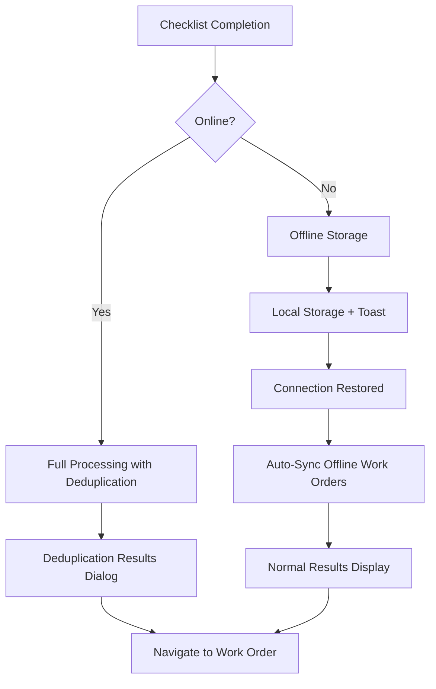

# Enhanced Work Order Priority and Offline Implementation

## Overview

This implementation provides comprehensive offline functionality and individual priority assignment for corrective work orders generated from checklist executions.

## Key Features Implemented

### 1. Individual Priority Assignment Per Work Order

#### Problem Solved
Previously, all work orders generated from a single checklist had the same priority, regardless of the severity of individual issues.

#### Solution
- **Priority Modes**: 
  - `Global`: Same priority for all orders (original behavior)
  - `Individual`: Different priority per issue (new recommended approach)

- **Auto-Assignment Logic**:
  - `Fail` status → `Alta` priority (immediate attention required)
  - `Flag` status → `Media` priority (requires review)
  - Mixed severities → Automatically suggests individual mode

#### Implementation Details
```typescript
// Auto-assign priorities based on issue severity
const newIndividualPriorities: Record<string, string> = {}
itemsWithIssues.forEach(item => {
  newIndividualPriorities[item.id] = item.status === 'fail' ? 'Alta' : 'Media'
})

// Smart mode detection
const hasFailures = itemsWithIssues.some(item => item.status === 'fail')
const hasFlags = itemsWithIssues.some(item => item.status === 'flag')

if (hasFailures && hasFlags && itemsWithIssues.length > 1) {
  setPriorityMode('individual') // Recommended for mixed severities
}
```

#### Backend Integration
```typescript
// Priority determination in API
let workOrderPriority = issue.priority || priority || 'Media'

// Auto-adjust priority based on issue status if no specific priority set
if (!issue.priority && issue.status === 'fail') {
  workOrderPriority = priority === 'Baja' ? 'Media' : priority
}
```

### 2. Comprehensive Offline Functionality

#### Problem Solved
- Deduplication results dialog would fail offline
- Work orders couldn't be created without internet connection
- Loss of data when connection drops during work order creation

#### Solution Architecture



#### Offline Storage Structure
```typescript
interface OfflineWorkOrderData {
  checklist_id: string
  items_with_issues: Array<{
    id: string
    description: string
    notes: string
    status: "flag" | "fail"
    priority: string  // Individual priority
  }>
  description: string
  asset_id: string
  consolidation_choices: {}
  enable_smart_deduplication: false  // Disabled offline
  consolidation_window_days: 30
  timestamp: number
  offline: true
}
```

#### User Experience Flow

1. **Offline Detection**:
   ```typescript
   const { isOnline } = useOfflineSync()
   
   if (!isOnline) {
     toast.info("Modo offline: La deduplicación inteligente no está disponible sin conexión")
   }
   ```

2. **Offline Storage**:
   ```typescript
   localStorage.setItem(`offline-work-orders-${checklist.id}`, JSON.stringify(offlineData))
   
   toast.success("Órdenes de trabajo guardadas para procesamiento offline", {
     description: "Se procesarán automáticamente cuando vuelva la conexión"
   })
   ```

3. **Auto-Sync on Reconnection**:
   ```typescript
   const handleWorkOrderCreated = async (workOrderId: string) => {
     const offlineData = localStorage.getItem(`offline-work-orders-${id}`)
     if (offlineData && isOnline) {
       // Process offline work orders automatically
       const response = await fetch('/api/checklists/generate-corrective-work-order-enhanced', {
         method: 'POST',
         headers: { 'Content-Type': 'application/json' },
         body: JSON.stringify(data)
       })
       
       if (response.ok) {
         localStorage.removeItem(`offline-work-orders-${id}`)
         toast.success("Órdenes de trabajo offline procesadas exitosamente")
       }
     }
   }
   ```

### 3. Enhanced User Interface

#### Priority Selection Interface

**Global Mode**:
```jsx
<RadioGroup value={globalPriority} onValueChange={setGlobalPriority}>
  {["Alta", "Media", "Baja"].map((priorityLevel) => (
    <Label className={getPriorityColor(priorityLevel)}>
      {getPriorityIcon(priorityLevel)}
      <span>{priorityLevel}</span>
      <span>{getPriorityLabel(priorityLevel)}</span>
    </Label>
  ))}
</RadioGroup>
```

**Individual Mode**:
```jsx
{priorityMode === 'individual' && (
  <div className="mt-2 p-2 bg-white rounded border">
    <Label>Prioridad para esta orden:</Label>
    <RadioGroup 
      value={individualPriorities[item.id]} 
      onValueChange={(value) => updateIndividualPriority(item.id, value)}
    >
      {/* Priority options for each item */}
    </RadioGroup>
  </div>
)}
```

#### Offline Indicators

- Connection status icons (`Wifi` / `WifiOff`)
- Mode-specific messaging
- Disabled features explanation
- Auto-sync progress feedback

### 4. Error Handling and Fallbacks

#### Connection Loss During Processing
```typescript
try {
  // Online processing attempt
  const response = await fetch('/api/...')
} catch (error) {
  // Fallback to offline storage
  if (offlineChecklistService) {
    await offlineChecklistService.saveOfflineChecklist(offlineId, submissionData)
    toast.info("Checklist guardado localmente como respaldo")
  }
}
```

#### Data Validation
```typescript
// Validate priorities before submission
if (priorityMode === 'individual') {
  const missingPriorities = itemsWithIssues.filter(item => !individualPriorities[item.id])
  if (missingPriorities.length > 0) {
    toast.error('Por favor asigne prioridad a todos los elementos')
    return
  }
}
```

## Technical Benefits

### 1. Improved Work Order Management
- **Granular Priority Control**: Each work order gets appropriate priority based on issue severity
- **Better Resource Allocation**: High-priority failures get immediate attention
- **Clearer Tracking**: Individual orders are easier to track and manage

### 2. Robust Offline Support
- **Zero Data Loss**: All work orders are preserved even without connection
- **Seamless Sync**: Automatic processing when connection returns
- **User Awareness**: Clear feedback about offline status and pending operations

### 3. Enhanced User Experience
- **Smart Defaults**: Automatic priority assignment based on issue type
- **Flexible Control**: Users can override auto-assignments when needed
- **Progressive Enhancement**: Full functionality online, graceful degradation offline

## Configuration Options

### Priority Mapping
```typescript
const priorityMapping = {
  'fail': 'Alta',    // Immediate attention required
  'flag': 'Media'    // Scheduled attention required
}
```

### Offline Behavior
```typescript
const offlineConfig = {
  enableSmartDeduplication: false,  // Disabled offline
  autoSyncOnReconnection: true,     // Auto-process when online
  localStoragePrefix: 'offline-work-orders-',
  maxOfflineAge: 24 * 60 * 60 * 1000  // 24 hours
}
```

## Testing Scenarios

### 1. Priority Assignment
- ✅ Mixed fail/flag items → Individual mode suggested
- ✅ All same severity → Global mode sufficient
- ✅ Manual override → User choice respected
- ✅ Backend processing → Individual priorities preserved

### 2. Offline Functionality
- ✅ Connection loss during dialog → Graceful offline storage
- ✅ Offline work order creation → Data preserved in localStorage
- ✅ Reconnection → Auto-sync with server
- ✅ Results display → Offline-aware messaging

### 3. Error Recovery
- ✅ API failure → Fallback to offline storage
- ✅ Partial sync → Retry mechanism
- ✅ Data corruption → Validation and cleanup

## Migration Notes

### Backward Compatibility
- Existing global priority selection still works
- API accepts both old and new priority formats
- Graceful degradation for older clients

### Database Changes
- No schema changes required
- Existing work_orders table supports individual priorities
- Enhanced API logic handles priority source detection

## Performance Considerations

### Client-Side
- Individual priorities stored in component state
- Efficient re-renders with proper dependency arrays
- Local storage cleanup on successful sync

### Server-Side
- Priority determination optimized per item
- Bulk operations for multiple work orders
- Efficient deduplication with priority awareness

This implementation provides a comprehensive solution for both individual priority assignment and robust offline functionality, ensuring work orders are created appropriately regardless of connection status while giving users granular control over priority assignment. 