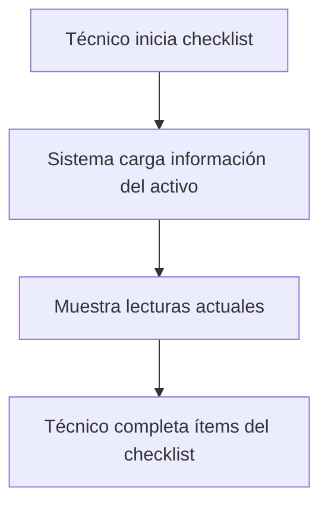
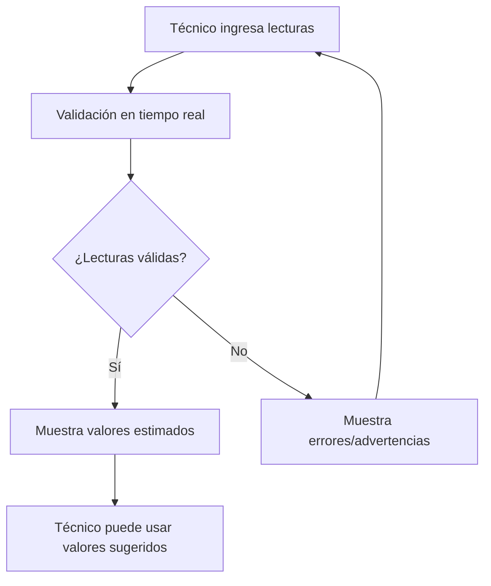
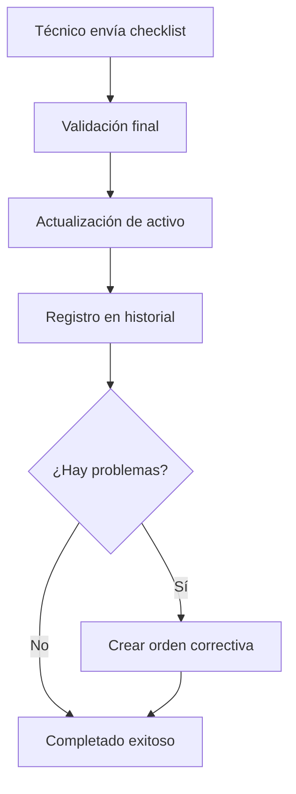

# 📋 PLANIFICACIÓN COMPLETA: GESTIÓN DE HORÓMETROS/KILOMETRAJE A TRAVÉS DE CHECKLISTS

## 🎯 OBJETIVO
Implementar un sistema automatizado para actualizar los horómetros y kilometraje de los equipos cada vez que se complete un checklist, garantizando que los datos de operación se mantengan actualizados y precisos para el cálculo de mantenimientos preventivos.

## 📊 ANÁLISIS DE LA IMPLEMENTACIÓN

### ✅ CAMBIOS REALIZADOS EN LA BASE DE DATOS

#### 1. **Ampliación de la tabla `completed_checklists`**
```sql
-- Nuevos campos agregados
ALTER TABLE completed_checklists 
ADD COLUMN equipment_hours_reading INTEGER,
ADD COLUMN equipment_kilometers_reading INTEGER,
ADD COLUMN reading_timestamp TIMESTAMPTZ DEFAULT NOW(),
ADD COLUMN previous_hours INTEGER,
ADD COLUMN previous_kilometers INTEGER;
```

**Campos agregados:**
- `equipment_hours_reading`: Lectura del horómetro al momento del checklist
- `equipment_kilometers_reading`: Lectura del kilometraje al momento del checklist
- `reading_timestamp`: Timestamp exacto de la lectura
- `previous_hours`: Horas previas (para auditoría)
- `previous_kilometers`: Kilómetros previos (para auditoría)

#### 2. **Funciones de base de datos creadas**

##### 🔧 `update_asset_readings_from_checklist()`
Función principal para actualizar lecturas de activos:
- Valida que las lecturas no sean menores (excepto resets)
- Actualiza horómetros/kilometraje en la tabla `assets`
- Registra en historial de mantenimiento
- Maneja casos especiales como resets de contadores

##### ✅ `validate_equipment_readings()`
Función para validar lecturas antes del envío:
- Verifica consistencia con lecturas actuales
- Calcula valores esperados basados en historial
- Genera advertencias para diferencias grandes
- Proporciona feedback en tiempo real

##### 📈 `get_expected_next_reading()`
Función para calcular lecturas esperadas:
- Analiza historial de lecturas recientes
- Calcula promedio de uso diario
- Estima lectura esperada basada en tiempo transcurrido

##### 🔄 `complete_checklist_with_readings()`
Función integrada para completar checklists:
- Procesa ítems del checklist
- Captura lecturas de equipo
- Actualiza activos automáticamente
- Crea órdenes correctivas si hay problemas

### 🚀 IMPLEMENTACIÓN DEL FRONTEND

#### 1. **Componente `EquipmentReadingsForm`**
Características principales:
- **Validación en tiempo real** con debounce de 500ms
- **Valores sugeridos** basados en historial
- **Retroalimentación visual** (verde/rojo/amarillo)
- **Diferenciación por unidad** de mantenimiento (horas/kilómetros)
- **Advertencias y errores** contextuales
- **Formato automático** de números

#### 2. **Actualización del componente `ChecklistExecution`**
Mejoras implementadas:
- Integración del formulario de lecturas
- Nuevo endpoint con validación
- Manejo de errores específicos
- Feedback de actualización exitosa
- Compatibilidad offline

#### 3. **Nuevos endpoints de API**

##### `/api/checklists/schedules/[id]/complete-with-readings`
- Completa checklist con captura de lecturas
- Validación previa de datos
- Actualización automática de activos
- Creación de órdenes correctivas

##### `/api/checklists/validate-readings`
- Validación en tiempo real
- Cálculo de valores esperados
- Detección de inconsistencias

## 🔄 FLUJO DE TRABAJO COMPLETO

### 1. **Inicio del Checklist**


### 2. **Captura de Lecturas**


### 3. **Completado y Actualización**


## 🎨 CARACTERÍSTICAS DEL DISEÑO

### 📱 **Experiencia de Usuario**
- **Interfaz intuitiva** con iconos descriptivos
- **Feedback visual inmediato** (colores y animaciones)
- **Información contextual** (lecturas actuales, estimadas)
- **Validación progresiva** (sin interrumpir el flujo)
- **Accesibilidad completa** (labels, ARIA)

### 🔧 **Funcionalidades Técnicas**
- **Auto-guardado** cada 30 segundos
- **Recuperación de borradores** en caso de desconexión
- **Validación asíncrona** con debounce
- **Manejo de errores** robusto
- **Compatibilidad offline** completa

## 🛡️ VALIDACIONES IMPLEMENTADAS

### 1. **Validaciones de Negocio**
- ✅ Las lecturas no pueden ser menores que las actuales (excepto resets)
- ✅ Diferencias muy grandes generan advertencias
- ✅ Unidad de mantenimiento determina campos requeridos
- ✅ Historial permite calcular valores esperados

### 2. **Validaciones Técnicas**
- ✅ Tipos de datos correctos (INTEGER)
- ✅ Valores no negativos
- ✅ Límites razonables por tipo de equipo
- ✅ Integridad referencial con activos

### 3. **Manejo de Casos Especiales**
- ✅ **Reset de contadores**: Permitido con advertencia
- ✅ **Primer uso**: No hay historial previo
- ✅ **Equipos nuevos**: Valores iniciales por defecto
- ✅ **Cambio de unidad**: Migración automática

## 📈 BENEFICIOS DE LA IMPLEMENTACIÓN

### 🎯 **Para la Gestión de Mantenimiento**
1. **Datos siempre actualizados** para cálculo de intervalos
2. **Reducción de errores manuales** en actualización
3. **Trazabilidad completa** de cambios en lecturas
4. **Automatización** del proceso de registro

### 👥 **Para los Técnicos**
1. **Proceso simplificado** sin pasos adicionales
2. **Validación en tiempo real** previene errores
3. **Valores sugeridos** basados en historial
4. **Feedback inmediato** sobre la calidad de datos

### 📊 **Para los Supervisores**
1. **Visibilidad completa** del estado de equipos
2. **Alertas automáticas** para inconsistencias
3. **Reportes precisos** de utilización
4. **Planificación mejorada** de mantenimientos

## 🔮 FUNCIONALIDADES FUTURAS

### 📱 **Mejoras de UX**
- [ ] Lectura por código QR/NFC
- [ ] Reconocimiento óptico de caracteres (OCR)
- [ ] Notificaciones push para recordatorios
- [ ] Comparación con equipos similares

### 📊 **Analítica Avanzada**
- [ ] Predicción de próximas lecturas con ML
- [ ] Detección de patrones anómalos
- [ ] Optimización de intervalos de mantenimiento
- [ ] Dashboard de utilización en tiempo real

### 🔧 **Integraciones**
- [ ] API para sistemas de telemetría
- [ ] Sincronización con ERP externo
- [ ] Exportación a sistemas de BI
- [ ] Integración con IoT sensors

## 🚨 CONSIDERACIONES IMPORTANTES

### 1. **Migración de Datos Existentes**
```sql
-- Los activos existentes mantienen sus lecturas actuales
-- No se requiere migración de datos históricos
-- Las nuevas lecturas se registran progresivamente
```

### 2. **Capacitación de Usuarios**
- **Técnicos**: Nuevo formulario de lecturas en checklists
- **Supervisores**: Nuevos reportes de utilización
- **Administradores**: Funciones de validación y auditoría

### 3. **Monitoreo y Mantenimiento**
- **Logs de validación** para detectar problemas
- **Alertas automáticas** para inconsistencias
- **Backup de datos** antes de actualizaciones masivas

## ✅ ESTADO DE IMPLEMENTACIÓN

### 🟢 **Completado**
- [x] Estructura de base de datos
- [x] Funciones de validación y actualización
- [x] Componente de captura de lecturas
- [x] API endpoints integrados
- [x] Validación en tiempo real
- [x] Documentación completa

### 🟡 **En Progreso**
- [ ] Pruebas de integración completas
- [ ] Validación con usuarios finales
- [ ] Optimización de performance

### 🔴 **Pendiente**
- [ ] Deployment a producción
- [ ] Capacitación de usuarios
- [ ] Monitoreo de adopción

---

## 🏆 CONCLUSIÓN

Esta implementación transforma completamente la gestión de horómetros y kilometraje, convirtiendo un proceso manual propenso a errores en un sistema automatizado, preciso y fácil de usar. La integración con los checklists garantiza que los datos se mantengan actualizados sin agregar complejidad al flujo de trabajo de los técnicos.

**Beneficio principal:** Los mantenimientos preventivos ahora se basarán en datos reales y actualizados, mejorando significativamente la precisión de la planificación y reduciendo costos operativos.

---
*Documento creado: $(date)*
*Versión: 1.0*
*Estado: Implementación Completa* 