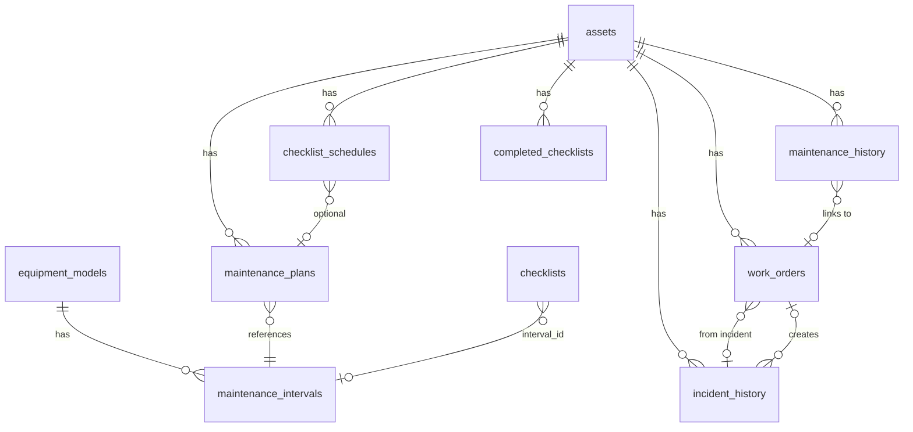

# Assets Associated Pages — Holistic Plan

> **Purpose**: Unify the asset-related page ecosystem with a coherent UX, clearer data model mental model, and consistent design. Synthesizes user feedback, Supabase schema relationships, and implementation priorities.

---

## Enhancement Summary

**Deepened on:** March 2026  
**Lens:** Simplicity, ease of management, avoid complexity  
**Rounds:** 2 (initial + phase-specific research)  
**Research sources:** best-practices-researcher, code-simplicity-reviewer, CMMS UX trends, Limble/UpKeep/Fiix patterns

### Guiding Principle

**Prioritize simplicity and ease of management.** Avoid making the system feel complex. Fix concrete issues first; add scope only with clear user demand.

### Key Changes From Research (Round 1)

1. **Interval linkage first** — Highest ROI: fix `mantenimiento/nuevo?planId=…` not setting `maintenance_plan_id` on WO. Delivers value without big architecture changes.
2. **Keep incidents and work orders separate** — Merging would overload the WO list and hide incident context. Improve linking instead (incident → WO, WO → incident).
3. **One chronological timeline** — Replace maintenance/incident tabs with a single timeline + filters. Simpler for technicians; one mental model.
4. **Merge report phases** — Phase 2 (Reports) + Phase 3 (Production Report) = one design pass. Both are "styled, shareable" for GM/sale.
5. **Defer Phase 7 (Polish)** — Edit modal, Create optimizations, Asset grouping: do only if users ask after Phases 1–6 ship.
6. **Narrow Phase 1 scope** — Skip generic "propose unified entry model." Focus on: fix interval linkage + clarify labels on existing buttons.
7. **Report metrics: start small** — Begin with 1–2 metrics that map to real decisions. Avoid "deviation vs same-model" or "fuel efficiency" unless proven need.
8. **Single primary CTA per screen** — One prominent action; context (preventive/corrective) chosen inside the flow, not via separate buttons.

### New Implementation Details (Round 2)

| Phase | Concrete Additions |
|-------|--------------------|
| **Phase 1** | Resolve `intervalId` → `maintenance_plans.id` before WO save; FK must point to plans, not intervals; current links send wrong param |
| **Phase 2** | 30-sec summary: Problem→Impact→Solution→Decision; Asset Health Score + 2–4 metrics; bar/line/bullet charts; 1-page PDF layout |
| **Phase 4** | Group by status (Overdue/Upcoming/Scheduled/Covered); one Programar per interval → pre-filled form; collapse Covered by default; cards over accordions |
| **Phase 5** | Filter chips (PM, Corrective, Inspection, All); Load more (15–25 events); color+icon; URL params for shareable views; 44px touch targets |

---

## Simplicity Principles (Design Guardrails)

Apply these to every phase:

| Principle | Application |
|-----------|-------------|
| **5–7 KPIs max per view** | Asset list, detail, reports: cap metrics. Each must answer "what should I do next?" |
| **Progressive disclosure** | Summary first; details on demand. Long text → truncate + "Ver más" |
| **Filter, don't split** | One timeline with type filters; avoid proliferating tabs |
| **One primary CTA per screen** | Primary action dominant; secondary options muted or linked |
| **Hick's Law** | Reduce options where possible (e.g., statuses, priorities). Simple CMMS: 2 priorities instead of 3, 2 statuses instead of 6 |
| **Fix before design** | Implement interval linkage, clarify labels before large redesigns |
| **Reuse over rebuild** | Extend existing reports UI; don't "rebuild" from scratch |
| **YAGNI** | Remove "optional if useful" items until there's concrete user need |

---

## 1. Data Model Overview (Supabase Schema)

Verification via Supabase MCP confirms these relationships:



**Key relationships:**
- **assets** — Central entity. Links to `equipment_models` (model_id), `plants`, `departments`.
- **maintenance_plans** — Bridges asset to interval: `asset_id` → assets, `interval_id` → maintenance_intervals.
- **maintenance_history** — Records performed work. `asset_id` → assets, `work_order_id` → work_orders. `maintenance_plan_id` stores interval reference (convention in code).
- **incident_history** — `asset_id` → assets, `work_order_id` → work_orders. Incident and work order are tightly coupled.
- **work_orders** — Can originate from: `incident_id` (incident flow), `maintenance_plan_id` (preventive from plan), or ad-hoc. Links to `service_orders`, `purchase_orders`.
- **checklist_schedules** — `asset_id` → assets, `template_id` → checklists, optional `maintenance_plan_id`.

**Structural observation:** Incidents, maintenance history, and work orders form a tangled graph. Incidents create work orders; maintenance history links to work orders; service orders and purchase orders further extend the chain. Multiple entry points (Nueva Orden, Incidente, Programar desde plan) create work orders without always linking to an interval.

---

## 2. User Input Summary (From Fill-in Table)

| Page | Intended Purpose | Desired Behavior | Priority |
|------|------------------|------------------|----------|
| **Asset List** | Quick view, main nav to asset | Fine as-is; asset grouping could help | Low |
| **Create Asset** | Create assets | Works but feels heavy; optimizations useful | Medium |
| **Reports** | *Deprecated currently* | Rebuild as real report: active incidents, corrective vs preventive, fuel efficiency, per-hour/km, deviation vs same-model assets | **High** |
| **Asset Detail** | Main hub, revision and planning | Hub + revision + planning; recently improved | — |
| **Edit Asset** | Edit asset info | Simpler UX (e.g. modal) preferred over full-page form | Medium |
| **Incidents** | See status, details, work order link | Incident management; consider merging with work orders (structural issue: incident ≈ second way to create WO) | **High** |
| **History** | See maintenance interventions | Simplify; work through incidents, maintenance history, maintenance plan, work orders architecture | **High** |
| **Checklist History** | Correlated to checklist asset detail | Already fulfills purpose | Low |
| **Maintenance Plan** | Model maintenance system + asset position | Easy view: model plan, asset position in cycle, program intervention (WO) per interval | **High** |
| **New Maintenance** | Schedule maintenance / create WO | Button mislabeled (creates WO, no interval link). Could align with incidents; interval linkage often missing | **High** |
| **Maintenance Detail** | Show maintenance performed | Behaves well; tweaks for better interlinking | Medium |
| **Production Report** | Asset status summary | Styled report for GM/sale; format needs major work | **High** |
| **Checklist Report** | Printed completed checklists | Fine as-is | Low |

---

## 3. Synthesis: Core Problems

### 3.1 Architectural Clarity
- **Incident ↔ Work Order**: Incident creates WO; WO has `incident_id`. Page "Incidentes" vs "Órdenes de Trabajo" — overlap. User suggests merging or unifying entry points.
- **Maintenance Plan ↔ Work Order**: `mantenimiento/nuevo` creates WO but "Nueva Orden" on detail page has no interval context. Interval linkage is often missing.
- **History**: "Historial" mixes maintenance and incidents; same underlying work-order-centric data, different views.

### 3.2 Deprecated / Rebuild
- **Reports** (`/activos/reportes`): Currently deprecated. Target: real analytics (incidents, preventive vs corrective, fuel efficiency, per-hour/km, deviation vs same-model).

### 3.3 UX Simplifications
- **Edit Asset**: Modal or lighter flow instead of full-page form.
- **Production Report**: Needs full restyle for sharing (GM summary, sale deliverable).
- **New Maintenance**: Clarify purpose — link to interval when coming from plan, or align with incident/WO flow.

### 3.4 Working as Intended (Minor Tweaks)
- Asset List, Checklist History, Checklist Report, Maintenance Detail.

---

## 4. Prioritized Implementation Phases

### Phase 1: Conceptual Unification (Architecture)

**Goal:** Clarify incident/maintenance/work-order relationships and entry points.

| Task | Scope | Owner |
|------|-------|-------|
| Fix interval linkage | `mantenimiento/nuevo?planId=…` must set `maintenance_plan_id` on WO. Highest ROI fix. | — |
| Clarify button labels | Ensure "Nueva Orden" vs "Programar" vs "Incidente" communicate purpose; no generic doc needed | — |
| Improve incident ↔ WO linking | Keep pages separate; add explicit cross-links (incident card → WO #X, WO → "from incident") | — |

**Deliverable:** Interval linkage working; clearer labels; explicit cross-links between incident and WO.

**Research insight (simplicity):** Skip the generic "propose unified entry model" design doc. Incidents = "what broke"; WOs = "what was done / needs doing." Merging would overload the WO list. Keep separate, improve linking. One clear concept per page.

**Implementation details (from research):**
- **URL params:** Use `planId` (maintenance_plans.id) or `intervalId` (maintenance_intervals.id). Resolve `intervalId` → `maintenance_plans.id` via `SELECT id FROM maintenance_plans WHERE asset_id = ? AND interval_id = ?` before saving WO.
- **FK:** `work_orders.maintenance_plan_id` must point to `maintenance_plans.id`, not `maintenance_intervals.id`. Do not store interval IDs in this column.
- **Form flow:** Read params on mount → fetch context in useEffect → prefill state. User edits live in state; URL only seeds initial values. Use `useSearchParams()` (Next.js); no need for nuqs for simple prefill.
- **Current bug:** Links send `planId=${interval_id}`. Either change to pass `maintenance_plans.id` when available, or keep `intervalId` and add resolve logic in the form.

---

### Phase 2: Reports Rebuild (Combined with Phase 3)

**Goal:** Replace deprecated reports and production report with one coherent, shareable asset report.

| Task | Scope | Owner |
|------|-------|-------|
| Start with 1–2 metrics | E.g., active incidents + corrective vs preventive %. Add fuel/deviation only if proven need | — |
| Reuse existing reports UI | Extend filters, calendar, AssetReportAnalytics; avoid full rebuild | — |
| Design shareable layout | One pass: GM/sale use case, PDF/print-ready, 30-second executive summary style | ui-ux-pro-max |
| Lead with the decision | Headlines as decisions ("Pipeline up 18% but conversion lagging"); avoid data-label-only headers | — |

**Deliverable:** `/activos/reportes` and production report as one design language; shareable, simple.

**Research insight (simplicity):** Merge Phase 2 + 3 into one report design pass. Executive reports: start with the question the report answers; 2–5 metrics max; summary first, detail in appendix. Avoid pie/radar; use bar/line, bullet charts, sparklines.

**Implementation details (from research):**
- **30-second summary structure:** Problem → Impact → Solution → Decision. 250–400 words; lead with main number; optimize for scanning.
- **2–5 metrics:** Asset Health Score (0–100 or banded) + 2–4 of: Planned vs reactive %, MTBF/OEE, downtime trend, emergency maintenance ratio, cost trend. Every metric answers "act or not."
- **Charts:** Bar (rankings), line (trends), bullet (target vs actual), sparklines (compact). Avoid pie, radar, gauges, 3D.
- **PDF layout:** One page summary; 1–1.25 in margins; 48 pt around charts; 65–75 char line length; 1.5× line height for print.

---

### Phase 3: Production Report (Merged into Phase 2)

*See Phase 2. One design pass covers both reports page and production report. Define a small MVP: one layout, one export format, then iterate.*

---

### Phase 4: Maintenance Plan Clarity

**Goal:** Maintenance plan page as the "easy view" of model system + asset position.

| Task | Scope | Owner |
|------|-------|-------|
| Fix "Programar" → nuevo linkage | planId/intervalId in URL, used when creating WO (same as Phase 1) | — |
| Emphasize model plan + asset position | Clear cyclic visualization; program intervention per interval | — |
| Modularize only where it hurts | Extract duplicated or hard-to-maintain sections; 1300 lines is manageable if coherent | pattern-recognition-specialist |

**Deliverable:** Maintenance plan with clear interval linkage; modularize only where maintenance pain exists.

**Research insight (simplicity):** Don't modularize for its own sake. Split only where you hit real pain. Avoid over-engineering the extraction.

**Implementation details (from research):**
- **Cyclic visualization:** Group by status first (Overdue / Upcoming / Scheduled / Covered); color-coded. Optionally group by cycle, then interval. Cards over nested accordions.
- **Program intervention:** One "Programar" per interval → opens pre-filled form. Target &lt;60 seconds, not zero clicks. No pure one-click; button → pre-filled form is standard.
- **Reduce clutter:** Collapse "Covered" by default. Single "Create WO" action per row/card.
- **Mobile:** Lists/cards, not scheduler grid. QR scan to jump to asset if applicable.

---

### Phase 5: History Simplification

**Goal:** Single coherent history view that's easy to scan.

| Task | Scope | Owner |
|------|-------|-------|
| Prefer one chronological timeline | Replace Todo/Mantenimientos/Incidentes tabs with single feed + type filters | — |
| Use clear type labels | Icons/badges: "PM", "Corrective", "Inspection" so users distinguish at a glance | — |
| Improve labeling first | Before full redesign, improve cross-links and tab labels; validate before big changes | — |

**Deliverable:** One timeline with filters, or improved tabs with clearer labels. Lighter change first.

**Research insight (simplicity):** Unified chronological timeline is simpler for technicians than switching tabs. One mental model. Filter, don't split. If tabs stay, improve labeling and cross-links before a full redesign.

**Implementation details (from research):**
- **Single timeline + filter chips:** Horizontal chips (PM | Corrective | Inspection | All) instead of tabs. URL params for shareable filtered views (`?type=corrective,pm`).
- **Load more:** ~15–25 events initially; "Load more" button (not infinite scroll; avoids disorientation).
- **Type differentiation:** Color + icon together (PM=wrench, Corrective=alert, Inspection=clipboard). One icon per event on left; high contrast for field use.
- **Touch targets:** Chips and events ≥44×44px. Limit to 3–5 event types for at-a-glance recognition.

---

### Phase 6: Incidents vs Work Orders — Keep Separate, Improve Links

**Goal:** Clear incident/WO UX without merging.

| Task | Scope | Owner |
|------|-------|-------|
| Keep incidents and WOs separate | One concept per page; merging overloads the WO list | — |
| Add explicit cross-links | Incident card: "→ WO #X"; WO card: "from incident" when applicable | — |
| Clarify incident page purpose | Incident = record + WO creation; primary action to create/link WO | — |

**Deliverable:** Incident and WO pages with explicit, visible cross-links. No merge.

**Research insight (simplicity):** Merging incidents into WO would hide incident context and overload the list. Keeping separate with clear links is simpler for the user.

---

### Phase 7: Polish and Optimization (Defer)

**Goal:** Lower-priority improvements. **Defer until Phases 1–6 ship and users request.**

| Task | Scope | Defer until |
|------|-------|-------------|
| Edit Asset modal | Replace full-page with modal/slide-over | User asks for simpler edit flow |
| Create Asset optimizations | Reduce perceived heaviness | User reports form as pain point |
| Asset List grouping | Optional grouping | User requests grouping |
| Maintenance Detail interlinking | Cross-links to WO, PO, service orders | Nice-to-have; low priority |

**Research insight (simplicity):** YAGNI. Ship core improvements first. Phase 7 items are incremental; only add when there's concrete user demand.

---

## 5. Subagent Task Assignments (Minimal)

Prefer fewer agents; combine exploration and pattern work where possible.

| Subagent | Phase | Responsibility |
|----------|-------|----------------|
| **explore** | 1, 5 | Map WO creation paths, historial structure (single pass) |
| **pattern-recognition-specialist** | 4 | Find only duplicated/hard-to-maintain sections; avoid over-modularization |
| **best-practices-researcher** | 2 | Report design for GM/sale (executive summary, 2–5 metrics) |
| **ui-ux-pro-max** (script) | 2 | Design system for reports (one pass) |

---

## 6. Shared Design Tokens (from MASTER + activos-detail)

Apply across all asset pages:

- **Colors:** Primary `#0F172A`, CTA `#0369A1`, Critical `#DC2626`, Warning `#D97706`, OK `#059669`
- **Typography:** SF Pro Display (headings), SF Pro Text (body); no Fira
- **Cards:** `rounded-xl`, `shadow-md`, `transition-colors duration-200`
- **Buttons:** Primary = CTA; Secondary = outline; Tertiary = secondary variant
- **Progressive disclosure:** Long text → truncate + "Ver más"
- **Breadcrumb:** Never raw UUID; use asset_id or name

---

## 7. Implementation Order (Simplified)

```
Phase 1 (Interval linkage + labels + links) ──→ Phase 4 (Maintenance plan) ──→ Phase 6 (Incident/WO links)
         │                                                                              │
         └──→ Phase 2 (Reports, merged with Prod Report) ←──────────────────────────────┘
         │
         └──→ Phase 5 (History: timeline or improved tabs)
         
Phase 7 (Polish) — DEFER until user demand
```

**Recommended sequence (simplicity-first):**
1. **Phase 1** — Interval linkage, label clarity, incident↔WO cross-links
2. **Phase 4** — Maintenance plan cleanup + interval linkage
3. **Phase 6** — Incident/WO explicit linking (keep separate)
4. **Phase 2** — Reports rebuild (includes production report; one design pass)
5. **Phase 5** — History simplification (one timeline + filters, or improved tabs)
6. **Phase 7** — Defer; only if users ask after 1–5 ship

---

## Anti-Patterns to Avoid (Simplicity)

| Avoid | Why |
|-------|-----|
| Merging incidents into WO page | Overloads list; hides incident context |
| Generic "unified entry model" design doc | Adds process without concrete fix |
| Modularizing for its own sake | 1300 lines can be fine if coherent |
| More than 5–7 KPIs per view | Cognitive overload (NN/G: 7±2 chunks) |
| Multiple primary CTAs per screen | Decision paralysis |
| Full report rebuild | Reuse existing UI; extend, don't replace |
| Speculative metrics (fuel, deviation) | Add only with proven user need |
| Phase 7 before user feedback | YAGNI |

---

## 8. Key Files Reference

| Area | Files |
|------|-------|
| Asset detail (hub) | [app/activos/[id]/page.tsx](app/activos/[id]/page.tsx), [components/assets/activos-detail/](components/assets/activos-detail/) |
| Maintenance plan | [app/activos/[id]/mantenimiento/page.tsx](app/activos/[id]/mantenimiento/page.tsx) |
| New maintenance | [app/activos/[id]/mantenimiento/nuevo/page.tsx](app/activos/[id]/mantenimiento/nuevo/page.tsx) |
| Incidents | [app/activos/[id]/incidentes/page.tsx](app/activos/[id]/incidentes/page.tsx) |
| History | [app/activos/[id]/historial/page.tsx](app/activos/[id]/historial/page.tsx) |
| Reports | [app/activos/reportes/page.tsx](app/activos/reportes/page.tsx) |
| Production report | [app/activos/[id]/reporte-produccion/page.tsx](app/activos/[id]/reporte-produccion/page.tsx) |
| Design system | [design-system/mantenpro/MASTER.md](design-system/mantenpro/MASTER.md), [design-system/mantenpro/pages/activos-detail.md](design-system/mantenpro/pages/activos-detail.md) |
