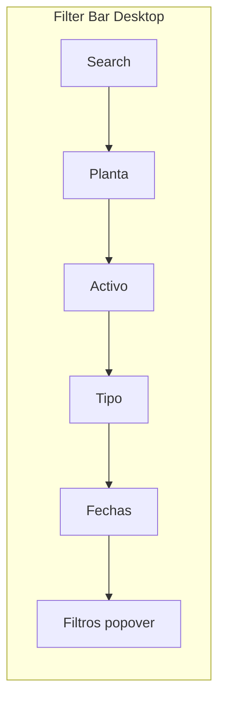
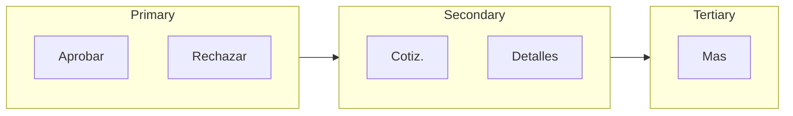

# Compras Dashboard — Holistic Design Plan

> **Purpose**: Step back from patchy iterations and define a coherent architecture for the Purchase Orders (Compras) experience. Includes full table redesign, filter redesign, and actions clarity. Plan first, then implement.

---

## 1. Current State (As-Is)

### Architecture
```
app/compras/page.tsx
├── ComprasDesktopInfoDrawer / ComprasMobileInfoDrawer
└── PurchaseOrdersList (dynamic import)
    ├── [MOBILE] PurchaseOrdersListMobile (~1260 lines)
    │   └── Own data fetch, filters, approval context, cards
    └── [DESKTOP] purchase-orders-list.tsx (~1379 lines)
        └── Own data fetch, filters, approval context, table + expanded rows
```

### Pain Points
| Area | Issue |
|------|-------|
| **Duplication** | Two full implementations (mobile + desktop) each with their own `loadOrders`, `loadApprovalContext`, filter logic, approval handlers |
| **Sprawl** | `purchase-orders-list.tsx` mixes: data loading, filtering, table rendering, row expansion, approval dialogs, delete flow, quotation popover |
| **Inconsistent UX** | Mobile: cards, tap-to-expand implicit. Desktop: table, chevron expand, row-click navigates. Different quick-access patterns |
| **Patchy additions** | QuotationQuickAccessPopover duplicates QuotationManager storage logic. Expanded rows bolted onto table. No shared row/card model |
| **Location** | Compras UI lives partly in `components/work-orders/` (historical) and partly in `components/compras/` |

---

## 2. Design Principles

1. **Single source of truth** — One data layer; mobile and desktop consume the same state.
2. **Progressive disclosure** — Show overview first; expand or open for detail. Don’t force navigation for routine review.
3. **Consistent quick access** — Same actions (quotations, approve, details) available in both views, different layout only.
4. **Composable building blocks** — Reusable: PO summary, actions bar, quotation access, expandable detail.
5. **Clear boundaries** — Data ↔ filters/tabs ↔ list container ↔ row/card ↔ actions.

---

## 3. Target Architecture

```
app/compras/page.tsx
└── ComprasModule (new orchestrator)
    ├── ComprasHeader (existing drawer + CTA)
    ├── useComprasData (single hook: orders, approval context, loading)
    ├── ComprasFilters (search, plant, asset, type, supplier, date)
    ├── ComprasTabs (status tabs)
    └── ComprasList
        ├── [MOBILE] PurchaseOrdersListMobile (unchanged — keep as-is)
        └── [DESKTOP] ComprasTable
            └── ComprasTableRow + ComprasRowDetail (expandable)
```

### Shared Components (new / extracted, desktop only)
| Component | Responsibility |
|-----------|----------------|
| `ComprasPORowContent` | Core PO info (ID, amount, status, type, supplier, OT, urgency, items preview) — used by table row |
| `ComprasQuickActions` | Approve / Reject / Registrar viabilidad / Ver detalles / dropdown |
| `ComprasQuotationAccess` | Single component for quotation quick access (popover or inline link) — unifies QuotationManager logic |
| `ComprasRowDetail` | Expandable content: full items, WO description, notes, quotation access |

---

## 4. Table Redesign (Full)

### Current Pain Points
- 11 columns crammed into a row; dense and hard to scan
- Icon-only action buttons (Check, X, FileText, Eye, MoreHorizontal) — FileText especially unclear ("Ver cotizaciones")
- No visual hierarchy between primary and secondary actions
- Row click navigates, chevron expands — two competing interactions
- Minimal breathing room; table feels utilitarian and unfriendly

### Target: Scannable, Friendly Table

**Column order and grouping** (left → right by importance):

| Group | Columns | Width | Notes |
|-------|---------|-------|-------|
| Expand | Chevron | w-9 | Clear "Expandir" tooltip |
| Identity | OC | w-24 | Monospace, link; Ajuste badge inline |
| Amount | Monto | w-24 | Right-aligned, semibold |
| Status | Estado | w-36 | Workflow badge or status badge |
| Context | Tipo, Proveedor | Tipo w-28, Proveedor flex | Badges; supplier truncate with tooltip |
| Location | OT / Activo | flex min-w-36 | WO link + asset • plant |
| Meta | Urgencia, Items | w-20, max-w-32 | Badge; items truncated with tooltip |
| People | Solicitante, Fecha | w-28, w-24 | Muted text |
| Actions | Acciones | min-w-[200px] | Labeled buttons, grouped (Section 6) |

**Visual design**:
- Header: `text-xs font-semibold text-muted-foreground uppercase tracking-wider` — lighter, less prominent
- Rows: `py-3` (was implicit small); alternating or subtle `hover:bg-muted/50`
- Cell padding: `px-4` (was default); consistent horizontal rhythm
- Borders: `border-b border-slate-100` for row separators; avoid heavy borders
- Typography: OC in `font-mono text-sm font-medium`; amounts `font-semibold`; metadata `text-muted-foreground text-sm`

**Expanded row**:
- `ComprasRowDetail`: grid 3 cols (items | WO description | notes + quotations), `p-5`, `bg-slate-50/60`
- Clear section headings with icons

---

## 5. Filter Redesign

### Current Pain Points
- Search + "Filtros" popover feels disconnected; filters hidden behind a click
- Filter chips appear below; no inline visibility of key filters on desktop
- Popover is long (5+ controls) — cognitive load to apply multiple filters
- No quick presets (e.g. "Este mes", "Pendientes míos")

### Target: Integrated, Scannable Filter Bar

**Layout** (desktop):

```
[ Search — flex-1 max-w-sm ] [ Planta ▼ ] [ Activo ▼ ] [ Tipo ▼ ] [ Fechas ] [ Filtros ]
```



- **Search**: Stays prominent; placeholder "Buscar por OC, proveedor, OT..."
- **Inline filters**: Planta, Activo, Tipo as compact Select components — visible without opening popover
- **Fechas**: Single "Rango" or "Desde-Hasta" compact control; or inline DateRangePicker
- **Filtros** button: Opens popover for Proveedor + any advanced filters; badge count when active

**Filter chips**:
- Below the bar when any filter active
- Same chip design; "Limpiar todo" link

**Mobile**: Keep search + "Filtros" popover; chips below. Inline filters collapse into popover.

**File**: Refactor [ComprasFilterBar.tsx](components/compras/ComprasFilterBar.tsx) to support inline vs popover layout via prop or viewport.

---

## 6. Actions Clarity (Integrated)

### Problem
Icon-only buttons (FileText = cotizaciones, Eye = detalles) are unclear. Whole Acciones column feels cryptic and unfriendly.

### Solution

**Action groups** (left → right):



1. **Primary (approval)**: `[Aprobar]` `[Rechazar]` or `[Registrar viabilidad]` — colored, with short label
2. **Secondary (review)**: `[Cotiz.]` `[Detalles]` — outline buttons, icon + label
3. **Tertiary**: `[Más ▼]` — dropdown for Realizar pedido, Marcar recibido, Eliminar

**Changes**:
- Cotizaciones: `Receipt` or `FileStack` icon + "Cotiz." label (not FileText alone)
- Detalles: Eye + "Detalles" label
- Approve/Reject: Keep icon-only but wrap in `Tooltip` with `delayDuration={200}`; or add "Aprobar"/"Rechazar" labels if space allows
- Más: Tooltip "Más acciones" or label "Más"
- Add `TooltipProvider delayDuration={200}` so tooltips appear quickly
- Acciones column: `min-w-[200px]` to fit labels; `gap-2` between buttons

**Component**: Extracted `ComprasQuickActions` (per holistic plan) will implement this API.

---

## 7. Information Hierarchy

### Row / Card (always visible)
- OC ID (link)
- Monto
- Estado / Workflow badge
- Tipo
- Proveedor
- OT + Activo • Planta
- Urgencia
- Items preview (truncated)
- Solicitante, Fecha

### Expanded / On demand
- Items (full list)
- Work order description
- Notes
- Quotation files (links)

### Actions (contextual)
- Pending + can act: Aprobar, Rechazar / Registrar viabilidad
- Always: Ver cotizaciones (icon + label)
- Dropdown: Realizar pedido, Marcar recibido, Eliminar
- **Note**: No "Ver detalles" button — row click already navigates to PO detail

---

## 8. Implementation Plan (Phases)

### Phase A: Extract & Unify Data Layer
- [x] Create `useComprasData` hook: `loadOrders`, `loadApprovalContext`, `orders`, `technicians`, `approvalContext`, `isLoading`
- [x] Use in both mobile and desktop paths; remove duplicate fetch logic from each

### Phase B: Filter Redesign
- [x] Refactor `ComprasFilterBar` for inline layout on desktop: Search + Planta + Activo + Tipo + Fechas inline; Proveedor in popover
- [x] Keep mobile layout (search + Filtros popover)
- [x] Preserve filter chips; optional quick presets ("Este mes") in popover

### Phase C: Extract Shared UI Blocks
- [x] Create `ComprasPORowContent` — renders core PO info from a normalized shape
- [x] Create `ComprasQuickActions` — approval (with Tooltip), Cotiz. + Detalles (icon + label), Más dropdown; uses `TooltipProvider delayDuration={200}`
- [x] Create `ComprasQuotationAccess` — replace QuotationQuickAccessPopover; unify with QuotationManager fetch logic
- [x] Create `ComprasRowDetail` — expandable: items, WO description, notes, quotation access

### Phase D: Table Redesign & Refactor
- [x] Apply table redesign specs: column order, widths, typography, padding, borders (Section 4)
- [x] `ComprasTable` = header + map → `ComprasTableRow` + `ComprasRowDetail` (when expanded)
- [x] `ComprasTableRow` = chevron + `ComprasPORowContent` + `ComprasQuickActions`
- [x] Actions: labeled Cotiz. (Detalles removed — row click navigates); Acciones column `min-w-[200px]`

### Phase E: Consolidate Location & Cleanup
- [x] Move Compras-specific components under `components/compras/`
- [x] Remove duplicated logic (mobile uses po-row-utils)
- [ ] Ensure QuotationManager and ComprasQuotationAccess share one quotation-fetch implementation (deferred)

---

## 9. File Structure (Target)

```
components/compras/
├── ComprasModule.tsx          # Orchestrator: data + filters + tabs + list
├── useComprasData.ts          # Data hook
├── ComprasFilterBar.tsx       # (existing, refactored for inline layout)
├── ComprasSummaryRibbon.tsx   # (existing, keep)
├── ComprasDesktopInfoDrawer.tsx
├── ComprasMobileInfoDrawer.tsx
├── ComprasTable.tsx           # Desktop table container
├── ComprasTableRow.tsx        # Single row + expandable detail
├── ComprasPORowContent.tsx    # Shared: core PO info display (desktop table)
├── ComprasQuickActions.tsx    # Shared: approve, details, dropdown
├── ComprasQuotationAccess.tsx # Shared: quotation popover (unified)
└── ComprasRowDetail.tsx       # Expandable: items, WO desc, notes, quotes

# Keep as-is (mobile is perfect)
components/work-orders/
├── purchase-orders-list.tsx   # Becomes thin wrapper → ComprasModule (desktop path)
└── purchase-orders-list-mobile.tsx  # Unchanged — no refactor
```

---

## 10. Success Criteria

- [ ] Single data fetch for Compras list (no duplicate loading)
- [ ] Desktop table uses shared components; mobile remains as-is (no refactor)
- [ ] One quotation-access implementation, used everywhere
- [ ] Clear separation: data → filters → list → row → actions
- [x] `purchase-orders-list.tsx` < 150 lines (orchestration only)
- [ ] Table: scannable, friendly; actions clearly labeled (Cotiz.; row click = detalles)
- [ ] Filters: key filters (Planta, Activo, Tipo) visible inline on desktop

---

## 11. Out of Scope (For Now)

- Changes to PO detail page (`/compras/[id]`)
- Changes to approval workflow logic
- New filter types beyond current set
- Performance (pagination, virtualization) — Phase G if needed

---

**Next Step**: Review this plan. If it aligns, implement Phase A (data layer), then B (filters), C (UI blocks), D (table), E (cleanup). Mobile stays as-is. No patches without this structure.
