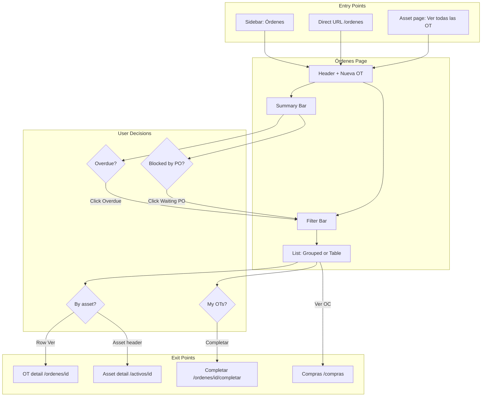

# Work Orders Page UI/UX Redesign Plan

> **Date:** 2026-03-12  
> **Focus:** Transform the work orders page from a flat, decontextualized list into a workflow-driven, asset-contextual experience so it becomes the **primary** place for work order management.  
> **Primary file:** [app/ordenes/page.tsx](../../app/ordenes/page.tsx)  
> **Core component:** [components/work-orders/work-orders-list.tsx](../../components/work-orders/work-orders-list.tsx) (1,025 lines — monolithic)

**Reference formats:** [ACTIVOS_PAGE_UI_UX_AUDIT_DEEPENED.md](./ACTIVOS_PAGE_UI_UX_AUDIT_DEEPENED.md), [COMPRAS_DASHBOARD_HOLISTIC_PLAN.md](./COMPRAS_DASHBOARD_HOLISTIC_PLAN.md)

---

## Enhancement Summary

### Key Goals
1. **Make `/ordenes` the primary destination** for work order management (not the asset page fallback).
2. **Asset context and workflow awareness** — show *which equipment*, *what’s blocking*, and *what needs attention*.
3. **Prioritization and grouping** — by asset (default), by technician, by workflow state.
4. **Component decomposition** — break the 1,025-line monolith into testable, reusable pieces.
5. **Mobile parity** — quick filters, swipe actions, skeleton loading, consistent with Compras/Activos patterns.

### Evidence-Based Problem
- Users **avoid** `/ordenes` and go to `/activos/[id]` to see work orders in context (StatusMaintenanceTab “Trabajos planificados”).
- Asset detail page provides: asset name, upcoming maintenances, maintenance history, and work orders **in one place**. The órdenes page offers only a flat list with minimal asset prominence.
- Current list: single `loadWorkOrders()` fetches all OTs; filters (tab + type + search) are client-side only; no plant, no technician filter, no date range, no grouping.

---

## 1. User Personas and Context

### Primary Users

| Persona | Role | Context | Typical Goals |
|---------|------|---------|---------------|
| **Supervisor** | Jefe de mantenimiento | Office or floor; triages daily work | “What needs my attention now?” Assign technicians, unblock (PO/quote), approve, track completion. |
| **Technician** | Técnico/Operador | Field, often mobile | “What’s my next job?” See assigned OTs, complete checklists, log parts. |
| **Coordinator** | Coordinador de planta | Multi-plant view | “Are we on track? What’s overdue? What’s costing us?” |
| **Manager** | Gerencia | Office; periodic | KPIs, trends, budget. Low frequency. |

### Usage Context (When/Where/How)

- **Desktop:** Supervisors triaging, assigning, approving; coordinators reviewing by plant/asset. Often alongside calendar and asset list.
- **Mobile:** Technicians in plant/field — “my OTs”, complete, view PO. One-handed, quick filters.
- **Entry points:** Sidebar “Órdenes de Trabajo”, dashboard module card, or from asset detail (“Ver todas las OT”).

### Decision Points on This Page

1. **“Do I have critical/overdue work?”** → Currently: scan full list or use “Pendientes” tab (no overdue vs pending distinction).
2. **“Which OT for this asset?”** → Currently: search by asset name (works) but no grouping by asset.
3. **“What’s blocked on procurement?”** → Currently: OC column in table; no dedicated “waiting on PO” view.
4. **“What did we complete today?”** → Currently: “Completadas” tab only; no “today” filter.
5. **“Create or edit OT?”** → Header “Nueva OT” and row actions exist; flow is clear.

### Information Hierarchy (What Matters First)

| Priority | Content | Current Placement |
|----------|---------|-------------------|
| P0 | Overdue / needs attention | **Missing** — no summary |
| P1 | Active (in progress) | Tab “En Progreso” |
| P2 | Find by asset / technician | Search only; no asset/technician filters |
| P3 | OT rows (ID, asset, type, status, OC, date, assigned) | Table / cards |
| P4 | Type filter (Preventive/Corrective) | One dropdown |
| P5 | Footer count | “Mostrando X de Y órdenes” |

**Observation:** No workflow summary (overdue, waiting PO, today completed). Tabs are status-based, not action-based. Asset is one column among many instead of a grouping dimension.

---

## 2. What’s Wrong With the Current Page (Evidence-Based)

### 2.1 Code and UX Evidence

| Issue | Evidence |
|-------|----------|
| **Flat, decontextualized list** | `WorkOrdersList` renders `filteredOrders` as a single list; no grouping. Asset appears as `order.asset?.name` in a cell/card, not as a grouping header. |
| **No asset-first entry** | Asset detail (`status-maintenance-tab.tsx`) shows “Trabajos planificados” with asset context and links to ` /ordenes?assetId=…&asset=…`. Órdenes page only uses `assetId`/`asset` for **search prefill** (lines 299–306), not for default grouping or prominent context. |
| **Monolithic component** | `work-orders-list.tsx` ≈ 1,025 lines: `WorkOrdersList`, `WorkOrderCard`, `MobileView`, `DesktopView`, `loadWorkOrders`, filter state, delete dialog, tab content duplicated 5× (same Mobile/Desktop switch per tab). |
| **Duplicate tab content** | Lines 443–518: each `TabsContent` (all, pending, approved, inprogress, completed) repeats the same `MobileView`/`DesktopView` with same props. Filtering is shared via `filteredOrders`; only tab value changes filter. |
| **Limited filters** | Only: search (text), type (Preventive/Corrective), status tabs. No plant, technician, priority, or date range. Compras has Planta, Activo, Tipo, Proveedor, Fechas + chips. |
| **No workflow summary** | No counts for “overdue”, “waiting on PO”, “completed today”. Compras has `ComprasSummaryRibbon` with pending/approved/validated and alert banner. |
| **Desktop actions inconsistency** | Mobile card: Ver, Editar, Completar, Ver OC, Eliminar. Desktop table: Ver, Ver Servicio, Incidente, Editar, Generar OC, Ver OC, Ver Checklist, Registrar Mantenimiento, Re-Programar, Cambiar Estado, Eliminar. “Ver Checklist” / “Re-Programar” / “Cambiar Estado” are not links (no `asChild`/`Link`). |
| **Single bulk fetch** | `loadWorkOrders()` fetches all work orders (no limit), then technicians and PO statuses in separate calls. No pagination; no summary-only query. |

### 2.2 Preferred Flow (Asset Page) vs Órdenes Page

**Asset detail (StatusMaintenanceTab)** gives:
- Same asset always in context (header).
- Three cards: Próximos Mantenimientos, Trabajos realizados, **Trabajos planificados** (work orders).
- In “Trabajos planificados”: type badge, incident link, order_id, description, technician, date, single “Ver Detalles” CTA; “Ver todas (N+)” and “Nueva OT” with `assetId` in query.
- Empty state: “Ver todas las OT” and “Nueva OT” with `assetId`.

**Órdenes page** gives:
- No default context; all OTs in one list.
- Status tabs + type + search; asset only as column/card field.
- No “overdue” or “waiting PO” or “today” summary.

So users who think “by asset” or “what’s urgent” naturally stay on asset detail. The redesign must bring **asset context** and **workflow summary** to `/ordenes` so it becomes the primary hub.

---

## 3. User Flow Analysis

### Flow A: “Check what’s overdue” (Urgent path)

```
Land on /ordenes → See tabs + list → (No dedicated overdue view) → Scroll or search
→ Maybe use “Pendientes” tab → Still mixed with non-overdue
→ Or go to /activos → Find asset → See overdue in “Próximos Mantenimientos”
```

**Issues:** No “Overdue” summary or one-click filter. Overdue is not distinguished from “Pendiente” in tab logic (pending = Pending || Quoted only).

### Flow B: “Find OTs for an asset” (Lookup path)

```
Land on /ordenes → Search by asset name (or arrive with ?assetId= & ?asset=)
→ List filters to matching OTs → Scan rows/cards
```

**Issues:** URL params prefill search (good) but no grouping by asset; multiple OTs for same asset appear as separate rows. No “group by asset” default.

### Flow C: “See what’s blocked on PO” (Procurement path)

```
Land on /ordenes → Scan “OC” column (desktop) or card (mobile) for status
→ Open dropdown → “Ver OC” if PO exists
```

**Issues:** No “Waiting on PO” summary or filter; user must scan full list. Compras has “Pendientes” and approval context; OT page has no equivalent.

### Flow D: “My work as technician” (Assignment path)

```
Land on /ordenes → No “Assigned to me” filter → Search own name or scroll
→ Find OT → Complete / Ver detalles
```

**Issues:** No technician filter; no “Mis OT” quick filter on mobile.

### Flow E: “What got done today” (Progress path)

```
Land on /ordenes → “Completadas” tab → All completed ever, sorted by created_at desc
→ No “today” filter
```

**Issues:** No “Completed today” or date range; completed tab is unbounded.

---

## 4. Mobile UX Gap Analysis

### Comparison with Mobile-Optimized Modules

| Feature | Compras | Activos (audit target) | **Órdenes (current)** |
|---------|---------|-------------------------|------------------------|
| `useIsMobile()` | Yes | Yes (audit) | **Yes** |
| Mobile-specific layout | Cards vs table | Grid + cards | **Cards vs table** ✓ |
| Pull-to-refresh | — | Recommended | **Yes** ✓ |
| Touch targets 44px+ | Yes | Audit | **Cards ok; dropdown trigger 8×8** |
| Sticky or top search | — | Recommended | **No** — search in flow |
| Summary/KPI cards | ComprasSummaryRibbon | 4 summary cards | **None** — only status tabs |
| Filter bar mobile | Search + Filtros popover | — | **Search + type dropdown** — no popover |
| Filter chips | Yes | — | **No** |
| Quick filters (e.g. “Mine”, “Overdue”) | — | — | **No** |
| Swipe actions on cards | — | — | **No** |
| Skeleton loading | Yes (list) | Recommended | **Spinner only** |

### Órdenes-Specific Mobile Issues

1. **Tabs on mobile:** Two rows (TabsList 2 cols + 3 Buttons); redundant and space-heavy. Could be one row scrollable or a single “Filter” chip that opens sheet.
2. **No summary:** Technicians can’t see “3 overdue” or “5 assigned to you” at a glance.
3. **WorkOrderCard:** Asset and metadata are present but “Ver Detalles” is primary CTA; no swipe for Complete or Ver OC.
4. **Footer:** “Mostrando X de Y” is good; no “Load more” (all data loaded).

---

## 5. Layout and View Hierarchy

### Current DOM Order (Top to Bottom)

1. `DashboardShell` > `DashboardHeader` (Órdenes de Trabajo, Nueva OT)
2. `Suspense` > `WorkOrdersList`
3. `PullToRefresh` > `Card` > `CardContent`:
   - Search + Type filter (one row)
   - Tabs (TabsList + on mobile extra row of buttons)
   - TabsContent (same list for all tabs)
   - Table (desktop) or card list (mobile)
4. `CardFooter` (count)
5. AlertDialog (delete)

### Above-the-Fold (Typical Viewports)

| Viewport | Above fold |
|----------|------------|
| 375×667 (mobile) | Header, search, type filter, part of tabs, start of cards |
| 768×1024 (tablet) | Header, search, type, full tabs, start of table/cards |
| 1440×900 (desktop) | Header, search, type, tabs, several table rows |

**Observation:** No summary cards; first substantive content is filters then list. Reordering to **summary → filters → list** (like Compras) would support “what needs attention?” before “list”.

### Proposed View Hierarchy (High Level)

1. **Header:** Title, subtitle, Nueva OT, optional view toggle (grouped / flat).
2. **Workflow summary bar:** 4 cards (Overdue, Active, Waiting on PO, Today completed) with counts; click to filter list.
3. **Sticky filter bar:** Search, Plant, Asset (optional), Technician, Priority, Date range, Filtros popover (mobile); filter chips when active.
4. **Primary content:** Grouped by asset (default) or by technician, or flat table; same data, different presentation.
5. **Footer:** Count and optional “Load more” when paginated.

---

## 6. Proposed Information Architecture

### Current (Broken)

```
[Header: "Órdenes de Trabajo" + Nueva OT]
[Tabs: Todas | Pendientes | Aprobadas | En Progreso | Completadas]
[Search | Tipo dropdown]
[Flat table or cards]
```

### Proposed

```
[Header: "Órdenes de Trabajo" + Nueva OT + (optional) View: Agrupado / Lista]

[WORKFLOW SUMMARY BAR]
┌────────────┐ ┌────────────┐ ┌────────────┐ ┌────────────┐
│ Overdue    │ │ En curso   │ │ Espera OC  │ │ Hoy        │
│ (N)        │ │ (N)        │ │ (N)        │ │ (N)        │
└────────────┘ └────────────┘ └────────────┘ └────────────┘

[FILTER BAR — sticky]
[Planta ▼] [Técnico ▼] [Prioridad ▼] [Fechas] [Search ______] [Filtros]

[GROUPED VIEW — default]
┌─ Activo A (plant X) — 3 OT ──────────────────────────────┐
│  OT-xxx │ Corrective │ Alta │ Juan P. │ Overdue        │
│  OT-yyy │ Preventive │ Normal │ María │ Hoy            │
├─ Activo B (plant X) — 2 OT ─────────────────────────────┤
│  ...                                                    │
└──────────────────────────────────────────────────────────┘

[FLAT VIEW — optional]
Sortable table with same columns + workflow badges
```

---

## 7. Component Decomposition Strategy

### Current Architecture

```
app/ordenes/page.tsx
└── WorkOrdersList (1,025 lines)
    ├── loadWorkOrders (fetch all + technicians + PO statuses)
    ├── State: workOrders, searchTerm, activeTab, typeFilter, technicians, purchaseOrderStatuses, delete dialog
    ├── Filter logic (tab + type + search + assetId param)
    ├── PullToRefresh > Card > Search + Type + Tabs
    ├── TabsContent × 5 (each: MobileView | DesktopView)
    ├── MobileView → WorkOrderCard list
    ├── DesktopView → Table with inline dropdown
    ├── WorkOrderCard (internal)
    ├── AlertDialog (delete)
    └── formatDate, get*Variant helpers
```

### Target Architecture (Compras-Aligned)

```
app/ordenes/page.tsx
└── WorkOrdersModule (orchestrator)
    ├── WorkOrdersHeader (title, Nueva OT; optional view toggle)
    ├── useWorkOrdersData (single hook: list, technicians, PO statuses, summary counts, loading)
    ├── WorkOrdersSummaryRibbon (4 workflow cards with counts; filter toggles)
    ├── WorkOrdersFilterBar (search, plant, technician, priority, date; mobile: popover + chips)
    ├── Tabs or filter state (driven by summary + filter bar)
    └── WorkOrdersList (presentation only)
        ├── [MOBILE] WorkOrderCard list (optional swipe actions)
        └── [DESKTOP] Grouped view or flat table
            ├── WorkOrdersGroupedByAsset (default)
            ├── WorkOrdersGroupedByTechnician (toggle)
            └── WorkOrdersTable (flat, sortable)
```

### Shared / New Components

| Component | Responsibility |
|-----------|----------------|
| `useWorkOrdersData` | Fetch work orders (paginated or initial batch), technicians, PO statuses; compute summary counts (overdue, in progress, waiting PO, completed today). Expose `orders`, `loadMore`, `isLoading`, `summary`. |
| `WorkOrdersSummaryRibbon` | Four cards with counts; clicking a card applies/removes that filter. Match `ComprasSummaryRibbon` pattern. |
| `WorkOrdersFilterBar` | Search + Planta + Técnico + Prioridad + Fechas inline on desktop; mobile: search + “Filtros” popover + filter chips. Match `ComprasFilterBar` (inline vs popover by viewport). |
| `WorkOrderRowContent` | Single OT row: OT ID, asset (link), type, priority, workflow badge, OC badge, date, technician, actions. Used in table and in grouped view rows. |
| `WorkOrderActionsMenu` | Dropdown: Ver, Editar, Completar, Ver OC / Generar OC, Ver Servicio, Incidente, Eliminar. Shared by table and card; fix “Ver Checklist” / “Re-Programar” / “Cambiar Estado” (link or remove). |
| `WorkOrderCard` (refactor) | Keep mobile card; add optional swipe actions; ensure 44px touch targets. |
| `WorkOrdersGroupedByAsset` | Group `WorkOrderWithAsset[]` by `asset_id` (and optionally plant); render collapsible sections; section header links to `/activos/[id]`. |
| `WorkOrdersGroupedByTechnician` | Group by `assigned_to`; section header shows technician name and count. |

### File Structure (Target)

```
components/work-orders/
├── WorkOrdersModule.tsx           # Orchestrator: data + summary + filters + list
├── useWorkOrdersData.ts           # Data hook + summary counts
├── WorkOrdersSummaryRibbon.tsx    # 4 workflow cards
├── WorkOrdersFilterBar.tsx        # Search, plant, technician, priority, dates; chips
├── WorkOrdersList.tsx             # Thin: chooses grouped vs table, passes data
├── views/
│   ├── WorkOrdersGroupedByAsset.tsx
│   ├── WorkOrdersGroupedByTechnician.tsx
│   └── WorkOrdersTable.tsx        # Flat table
├── WorkOrderRowContent.tsx        # Shared row content
├── WorkOrderActionsMenu.tsx       # Shared dropdown
├── WorkOrderCard.tsx              # Mobile card (extract from current)
└── work-order-badges.ts           # getStatusVariant, getTypeVariant, getPriorityVariant, workflow badge label
```

---

## 8. Filter Bar Design (ComprasFilterBar Pattern)

- **Desktop:** Inline: Search (flex-1 max-w-sm) + Planta + Técnico + Prioridad + Fechas (Desde/Hasta or range) + “Filtros” popover for secondary filters. Filter chips below when any active; “Limpiar todo”.
- **Mobile:** Search full width + “Filtros” button (popover with all filters); filter chips below. Same chip design as Compras (e.g. sky-100/sky-800).
- **Options:** Planta and Técnico from data (assets/plants from work orders or profiles); Prioridad = Critical, High, Normal, Low; Fechas = Overdue, Hoy, Esta semana, Este mes, Custom range.
- **URL:** Persist `assetId`, `plant`, `technician`, `priority`, `from`, `to` in URL so “Ver todas las OT” from asset detail keeps context.

---

## 9. Data Fetching Improvements

| Current | Proposed |
|---------|----------|
| Single query: all work orders, no limit | Initial load: e.g. 50 most recent (or by priority); cursor-based “Load more” or infinite scroll. |
| No summary query | Lightweight query or in-memory pass for counts: overdue, in progress, waiting PO, completed today. Optionally RPC that returns counts + first page. |
| Technicians: active + assigned (2 queries) | Keep; ensure assigned are always resolved for list. |
| PO statuses: by WO IDs (1 query) | Keep; consider including in same graph if using an API layer. |
| Filters 100% client-side | Keep filters client-side for first phase; later, push plant/date to server for very large datasets. |

---

## 10. Mobile UX Improvements (Concrete)

| Item | Action |
|------|--------|
| Summary on mobile | Show WorkOrdersSummaryRibbon (compact 2×2 or horizontal scroll) so “Overdue” and “Mine” are visible. |
| Quick filters | Chips: “Overdue”, “Mis OT”, “Hoy” (tappable, compose with filter bar). |
| Swipe actions | On WorkOrderCard: swipe left → “Completar” and “Ver OC” (or “Ver”). |
| Skeleton | Replace spinner with skeleton cards (3–5) matching WorkOrderCard layout. |
| Tabs | Replace two-row tabs + buttons with single row (scrollable) or “Filtros” that opens sheet (summary + status). |
| Touch targets | Ensure dropdown trigger and card actions ≥ 44px; use hitSlop if needed. |

---

## 11. Implementation Phases (Priorities)

### Phase 1: Foundation and Summary (High impact, low risk)
- [ ] Extract `useWorkOrdersData` (or keep single fetch but add summary counts in hook).
- [ ] Add `WorkOrdersSummaryRibbon` (4 cards: Overdue, Active, Waiting PO, Today); clicking toggles filter state.
- [ ] Replace status tabs with summary-driven filter (or keep one “Todas” tab and drive rest from summary).
- [ ] Add Planta dropdown to filter bar (data from work orders’ assets or plants).
- [ ] Decompose: move `WorkOrderCard`, `formatDate`, badge helpers to separate files; reduce `work-orders-list.tsx` to < 300 lines.
- **Effort:** 1–2 sessions.

### Phase 2: Asset-Grouped View and Filter Bar
- [ ] Build `WorkOrdersFilterBar` (search, plant, technician, priority, dates; mobile popover + chips).
- [ ] Build `WorkOrdersGroupedByAsset`; default view = grouped; asset header links to `/activos/[id]`.
- [ ] Add grouping toggle: “Por activo” / “Por técnico” / “Lista” (flat table).
- [ ] Persist key filters in URL (`assetId`, `plant`, etc.) and read on load.
- **Effort:** 1–2 sessions.

### Phase 3: Workflow Badges and Actions
- [ ] Introduce workflow badges (Nueva, Esperando cotización, Aprobada, En progreso, Completada) with short subtitle where useful (e.g. “Esperando OC #123”).
- [ ] Add “blocked by” hints (unassigned, waiting PO, waiting quote).
- [ ] Unify and fix desktop actions: extract `WorkOrderActionsMenu`; make “Ver Checklist” / “Re-Programar” / “Cambiar Estado” either links or remove.
- [ ] Smart date copy: “Vencida hace 3 días”, “Hoy”, “En 2 días”.
- **Effort:** 1 session.

### Phase 4: Mobile and Performance
- [ ] Quick filter chips on mobile (Overdue, Mis OT, Hoy).
- [ ] Skeleton loading for list.
- [ ] Optional swipe actions on `WorkOrderCard`.
- [ ] Paginated or “Load more” for list (e.g. 50 per page).
- **Effort:** 1–2 sessions.

---

## 12. Success Criteria

| Metric | Current | Target |
|--------|---------|--------|
| Primary entry for OT management | Users prefer `/activos/[id]` | `/ordenes` is primary; asset page links to “Ver todas” for that asset |
| Time to find a specific OT | Search + scroll | &lt; 5 s with filter + grouped view |
| Visibility of overdue / blocked | None | Summary bar + one-click filter |
| Component size | 1 file ≈ 1,025 lines | No file &gt; 250 lines; clear separation of data/filters/list/actions |
| Mobile: summary + quick filters | None | Summary visible; chips for Overdue / Mine / Today |

---

## 13. Mermaid: User Flow Diagram



---

## 14. Industry Patterns (CMMS / Maintenance)

- **Asset-centric triage:** Supervisors think by equipment; grouping by asset (and plant) matches mental model. Default “group by asset” is critical.
- **Workflow visibility:** “Blocked by” (PO, quote, assignment) is standard in CMMS; summary cards for “overdue” and “waiting PO” reduce cognitive load.
- **Technician view:** “My work” filter and “assigned to me” quick filter are expected on mobile.
- **Completion today:** Daily progress (“what we closed today”) supports stand-ups and reporting.
- **Design alignment:** Summary ribbon (Compras), filter bar + chips (Compras), grouped lists (Activos/checklists) — reuse same patterns for consistency.

---

## 15. References

### Internal
- [ACTIVOS_PAGE_UI_UX_AUDIT_DEEPENED.md](./ACTIVOS_PAGE_UI_UX_AUDIT_DEEPENED.md) — User flows, mobile gap, layout hierarchy.
- [COMPRAS_DASHBOARD_HOLISTIC_PLAN.md](./COMPRAS_DASHBOARD_HOLISTIC_PLAN.md) — Data layer, filter bar, table redesign, file structure.
- [ComprasFilterBar.tsx](../../components/compras/ComprasFilterBar.tsx) — Inline vs popover, chips.
- [ComprasModule.tsx](../../components/compras/ComprasModule.tsx) — useComprasData, summary ribbon, tabs.
- [status-maintenance-tab.tsx](../../components/assets/activos-detail/tabs/status-maintenance-tab.tsx) — How work orders are shown in asset context (preferred flow).
- [types/index.ts](../../types/index.ts) — WorkOrder, WorkOrderWithAsset, WorkOrderStatus, MaintenanceType, ServiceOrderPriority.

### Out of Scope (For Now)
- Changes to OT detail page (`/ordenes/[id]`) or create/edit flows.
- New workflow states or approval logic.
- Real-time subscriptions for OT updates.
- Offline or PWA-specific behavior.

---

**Next step:** Approve this plan; then implement Phase 1 (foundation, summary bar, filter bar start, decomposition). Iterate with Phase 2 (grouped view, full filter bar) so `/ordenes` becomes the primary work order management page.
