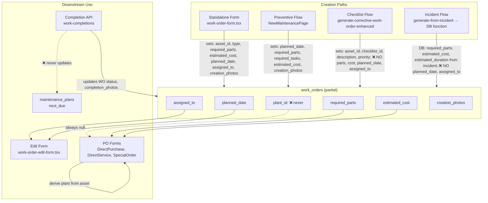

# Work Order Creation – Compiled Context Document

*Synthesized from five subagent investigations for the Lead Engineer.*

---

## 1. Executive Summary

Five parallel investigations revealed systematic gaps across work order creation, editing, scheduling, and PO integration. The system supports four creation paths—standalone form, preventive plan form, corrective checklist dialog, and incident auto-creation—but each path populates different fields and leaves critical columns unset. **`plant_id` is never set at work order creation** in any flow, affecting PO attribution, RLS, and reporting. The checklist API creates work orders without `required_parts`, `estimated_cost`, `planned_date`, or `assigned_to`; the incident flow sometimes sets parts and cost via the DB function, but the app completion API never updates `maintenance_plans.next_due`, causing schedule data to go stale.

Auto-created work orders (incident and checklist origins) arrive with null `planned_date`, null or empty `assigned_to`, and often null `required_parts`. The edit form is uniform across all origins and offers no origin-specific guidance. Creation evidence (photos from incident/checklist) is not carried over to the WO. Users must manually add scheduling, assignment, and parts in the edit flow before the WO is actionable.

PO integration suffers from missing upstream data: WO `plant_id` is never populated, so PO forms derive plant from asset at render time. `assigned_supplier_id` is not passed from WO to PO creation. Checklist-origin WOs never get `required_parts` or `estimated_cost` at creation, so PO creation lacks pre-filled parts.

CMMS standards distinguish creation (<60 sec), planning (enrichment), and execution phases. Corrective WOs should be minimal at creation and enriched in planning; preventive WOs should inherit from the plan. The system partially aligns but lacks planned_date for scheduling, due_date for SLA, asset availability checks, 4-level priority enforcement, and consistent evidence capture at creation/progress/completion.

---

## 2. Consolidated Findings by Theme

### 2.1 Parameters Audit

| Column / Concept | Classification | Current State | Files |
|------------------|----------------|---------------|-------|
| `plant_id` | C – never set | No creation path populates it | All creation flows |
| `suggested_supplier_id` | D – unused | Never set by any flow | `work-order-form.tsx`, PO forms |
| `assigned_supplier_id` | C – rarely used | WorkOrderForm can update post-insert; not passed to PO | `work-order-form.tsx` ~513 |
| `checklist_id` | A – used | Corrective WOs from completed_checklists.id | `generate-corrective-work-order-enhanced/route.ts` |
| `preventive_checklist_id` | B – distinct | Preventive execution checklist; different from corrective checklist_id | `useWorkOrderFilters.ts` 108–117 |
| `type` / `status` | Inconsistent | Mix of `corrective`/`preventive`, `Pendiente`/`En progreso`; enum vs string | `types`, `complete_schema` |

**Semantics:**
- `checklist_id` = FK to `completed_checklists` for corrective origin
- `preventive_checklist_id` = execution checklist for preventive flow; filters treat `!checklist_id && !preventive_checklist_id` as manual

### 2.2 Purchase Order Integration

| Finding | Detail | Files |
|--------|--------|-------|
| Checklist API never sets `required_parts` or `estimated_cost` | New WOs from checklist have null parts/cost | `app/api/checklists/generate-corrective-work-order-enhanced/route.ts` 456–469 |
| Incident API sometimes does | `generate_work_order_from_incident` DB function maps incident parts → `required_parts`, labor_cost → `estimated_cost` | `complete_schema.sql` 2799–2833, `app/api/work-orders/generate-from-incident/route.ts` |
| `plant_id` never set at WO creation | PO forms derive plant from `workOrder.asset?.plant_id`; WO itself has null | `DirectPurchaseForm.tsx` 739–743, `DirectServiceForm.tsx` 520–531 |
| `assigned_supplier_id` not passed to PO | WO may have supplier; PO creation does not prefill | `lib/services/purchase-order-service.ts`, PO form components |

### 2.3 Edit Flow for Auto-Created Work Orders

| Finding | Detail | Files |
|---------|--------|-------|
| Null `planned_date` | Incident and checklist WOs never set it | `generate_work_order_from_incident`, `generate-corrective-work-order-enhanced` |
| Null `assigned_to` | Both flows leave assignment empty | Same |
| Often null `required_parts` | Checklist flow never sets; incident only when parts exist | Same |
| Same edit form for all origins | No branching by `incident_id` / `checklist_id` / `maintenance_plan_id` | `components/work-orders/work-order-edit-form.tsx` |
| No origin-specific guidance | No prompts like "Add planned date" or "Assign technician" for auto-created | `work-order-edit-form.tsx` |
| Creation photos not carried over | Incident/checklist evidence not mapped to `creation_photos` | Incident flow, checklist flow |

### 2.4 Scheduling

| Finding | Detail | Files |
|---------|--------|-------|
| `planned_date` only required in preventive flow | NewMaintenancePage requires it; others don't | `app/activos/[id]/mantenimiento/nuevo/page.tsx` 489 |
| Incident and checklist flows never set `planned_date` | Created with null | `generate_work_order_from_incident`, `generate-corrective-work-order-enhanced` |
| No filters/sort by `planned_date` | Filters support tab, asset, technician, type, origin, dates (from/to) but not planned_date | `hooks/useWorkOrderFilters.ts` |
| No alerts for upcoming/overdue | No UI or scheduled job for planned_date-based alerts | — |
| No asset unavailability checks | Scheduling does not consider asset status | — |
| `update_maintenance_plan_after_completion` never called | App completion uses direct `work_orders` update; no RPC | `app/api/maintenance/work-completions/route.ts` |
| `maintenance_plans.next_due` can go stale | No update path from app completion | `complete_schema.sql` 7260–7289 |

### 2.5 Maintenance Domain (CMMS Standards)

| Phase | Standard | Current Alignment |
|-------|----------|-------------------|
| Creation | <60 sec; minimal data | Partially; incident/checklist are fast but missing fields |
| Corrective | Minimal at creation, planning enriches | Creation OK; planning/enrichment fragmented (edit form, no guided flow) |
| Preventive | Inherit from plan | NewMaintenancePage prefills from plan; required_tasks/required_parts updated post-insert |
| Scheduling | `planned_date` for when; `due_date` for SLA | Only preventive sets planned_date; no due_date column/SLA |
| Asset availability | Check before scheduling | Not implemented |
| Priority | 4-level (e.g. Alta/Media/Baja/Crítica) | Used but not consistently enforced |
| Evidence | At creation, progress, completion | Creation: partial; progress/completion: supported |

---

## 3. Critical Gaps (Prioritized)

1. **`plant_id` never set at WO creation** — Affects PO attribution, RLS, reporting. Set from `asset.plant_id` in all creation paths.
2. **Checklist API omits `required_parts`, `estimated_cost`, `planned_date`, `assigned_to`** — WOs are incomplete for PO and scheduling.
3. **App completion does not update `maintenance_plans.next_due`** — `work-completions` must call logic equivalent to `update_maintenance_plan_after_completion` or `complete_work_order` for preventive WOs.
4. **Edit form lacks origin-specific guidance** — Auto-created WOs need prompts for planned_date, assigned_to, required_parts.
5. **Creation evidence not transferred** — Incident documents and checklist issue photos should map to `creation_photos`.
6. **PO forms do not receive `assigned_supplier_id` from WO** — Prefill supplier when WO has it.
7. **No filters/sort by `planned_date`** — Needed for scheduling views and alerts.
8. **`suggested_supplier_id` unused** — Either use it or remove; document semantics.

---

## 4. Data Flow Diagram

---

## 5. Cross-References for Implementation

### Creation

| Path | File | Key Logic |
|------|------|-----------|
| Standalone / manual | `components/work-orders/work-order-form.tsx` | `handleSubmit` ~415; insert workOrderData ~479 |
| Preventive | `app/activos/[id]/mantenimiento/nuevo/page.tsx` | `handleSubmit` ~458; workOrderData ~480; update required_parts/required_tasks ~513 |
| Checklist (corrective) | `app/api/checklists/generate-corrective-work-order-enhanced/route.ts` | Insert ~456; consolidation update ~328 |
| Incident | `app/api/work-orders/generate-from-incident/route.ts` | RPC `generate_work_order_from_incident` |
| Incident DB function | `complete_schema.sql` ~2760 | `generate_work_order_from_incident` |
| Incident trigger | `components/assets/dialogs/incident-registration-dialog.tsx` | ~193; calls generate-from-incident |

### Edit

| Component | File | Notes |
|-----------|------|-------|
| Edit form | `components/work-orders/work-order-edit-form.tsx` | Single form; `isFromChecklist` ~69; no origin-specific sections |

### Completion

| Flow | File | Notes |
|------|------|-------|
| App completion | `app/api/maintenance/work-completions/route.ts` | Direct `work_orders` update ~181; inserts `maintenance_history`; **does not** update plans |
| DB complete (unused by app) | `complete_schema.sql` ~1327 | `complete_work_order`; updates plans inline |
| Plan update (unused) | `complete_schema.sql` ~7260 | `update_maintenance_plan_after_completion(asset_id, interval_value, completion_date)` |

### PO Integration

| Component | File | Notes |
|-----------|------|-------|
| PO plant attribution | `components/purchase-orders/creation/DirectPurchaseForm.tsx` | ~739–743: `workOrder.plant_id ?? workOrder.asset?.plant_id` |
| DirectServiceForm | `components/purchase-orders/creation/DirectServiceForm.tsx` | ~520–531: plant from WO or asset |
| SpecialOrderForm | `components/purchase-orders/creation/SpecialOrderForm.tsx` | ~730–735 |
| Research | `docs/RESEARCH_ASSET_ASSIGNMENT_AND_PO_PLANT_ATTRIBUTION.md` | Plant attribution analysis |

### Filters & Types

| File | Notes |
|------|-------|
| `hooks/useWorkOrderFilters.ts` | originFilter: incident, checklist, preventive, manual; `checklist_id` vs `preventive_checklist_id` |
| `types/supabase-types.ts` | work_orders Row/Insert ~7619 |
| `lib/work-order-status-tabs.ts` | Status tabs and mapping |
