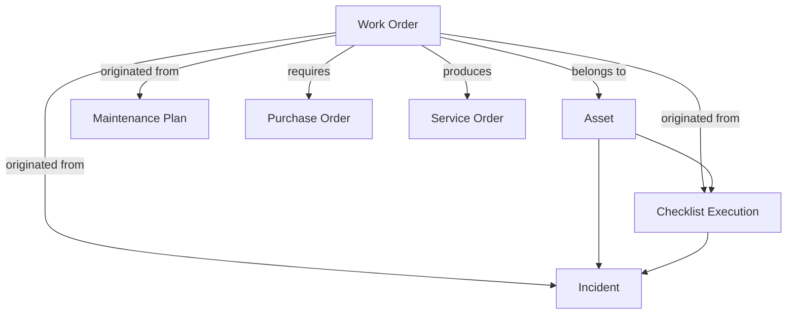

# Work Order Details View — Deepened UX Plan

## Enhancement Summary

**Deepened on:** March 2026  
**Focus:** User behaviour, patterns, purpose, and relationships — the foundations that elevate UX beyond technical correctness.  
**Primary insight:** The work order detail page must answer "Why does this exist?", "Who needs what?", and "What can I do next?" before layout and components.

### Key Improvements

1. **User-centric foundation** — Persona × action matrix, job stories, and typical journeys replace feature-first thinking
2. **Corrective vs preventive UX** — Different information needs by type: corrective emphasizes ORIGEN + recurrence (what broke, chronic?); preventive emphasizes schedule, ciclo, intervalo (when will it be held). Layout and sections adapt accordingly.
3. **Relationship-aware UX** — Work order as hub; every related entity (asset, incident, checklist, PO, service order) surfaced with intent, not just links
4. **Action hierarchy** — Primary vs secondary actions mapped by role and status; role-based visibility via `useAuthZustand` + `role-permissions`
5. **Technical refactor** — Router pattern, component extraction, mobile view — all informed by the above
6. **Roles and schema** — Plan uses current maintenance structure (GERENTE_MANTENIMIENTO, COORDINADOR_MANTENIMIENTO, MECANICO) and correct table relationships per `complete_schema.sql`

---

## Part 0: User Behaviour, Patterns, Purpose & Relationships

*This section is the UX foundation. Implementation follows from it.*

### 0.1 Purpose of a Work Order (User Mental Model)

A work order answers four questions for maintenance personnel:

| Question | User intent | Current UX gap |
|----------|-------------|----------------|
| **Why does this exist?** | Trace back to the source — checklist fail, incident report, preventive schedule, or ad-hoc | ORIGEN section missing or buried; origin badges inconsistent |
| **What is the problem?** | Understand scope (description, tasks, parts) | Description visible; tasks/parts sometimes hidden or scattered |
| **Where does it fit?** | See asset, cost flow, and downstream entities | EntityRelations exists but feels like "extra links" not context |
| **What do I do next?** | Assign, schedule, generate PO, complete, or escalate | Actions duplicated; no clear "next step" cue by status |

**Principle:** The detail page should answer all four within 3 seconds of landing. Information hierarchy must mirror this order.

### 0.2 Personas & Their Actions

**Role analysis (from `lib/auth/role-model.ts`, `lib/purchase-orders/workflow-policy.ts`, and business rules):**

| Role | Scope | PO approval? | Primary responsibilities |
|------|-------|--------------|---------------------------|
| **GERENTE_MANTENIMIENTO** | Global | Yes (technical approver) | Approves POs (validación técnica). Does not create OTs. |
| **COORDINADOR_MANTENIMIENTO** | Plant | No ($0 limit) | Creates OTs and OCs. Assigns technicians, schedules, generates POs. |
| **JEFE_PLANTA** | Plant | **No** (does not authorize OCs) | Monitors/assesses asset state in plant, runs checklists, reviews issues, adds issues. Supervisory/operational visibility, not purchasing authority. |
| **MECANICO** | Plant | No | Executes work orders. Completes tasks, uploads evidence. |
| **OPERADOR** | Plant | No | Executes checklists. May report issues that generate OTs. |
| **DOSIFICADOR** | Plant | No | Executes checklists, manages diesel. Similar to OPERADOR with inventory. |
| **AREA_ADMINISTRATIVA** | Global | Yes (viability + final) | Cost review, PO viability, approval in some paths. |
| **VISUALIZADOR** | Global | No | Read-only. |

*Note: `role-permissions.ts` still shows JEFE_PLANTA with authorizationLimit 50000; the actual PO workflow (`workflow-policy.ts`, `purchase-order-approval-notification`) explicitly excludes JEFE_PLANTA from approving OCs. Business rule: only GERENTE_MANTENIMIENTO does technical approval.*

| Persona | Role(s) | Primary actions on details page | Secondary actions | What they need first |
|---------|---------|----------------------------------|-------------------|----------------------|
| **Coordinador** | COORDINADOR_MANTENIMIENTO | Assign technician, schedule, generate PO | Edit, view cost, see recurrence | Asset, description, status, "next step" |
| **Jefe Planta** | JEFE_PLANTA | Monitor, review recurrence, add issues | View asset, link to checklist, review issues | Asset state, recurrence badge, origin, issue history |
| **Gerente Mantenimiento** | GERENTE_MANTENIMIENTO | Approve PO (via OC link when pending) | View cost, recurrence, monitor | Status, cost, PO approval state, asset |
| **Técnico** | MECANICO | Complete work, upload evidence | View tasks, parts, asset location | Tasks, parts, asset info, "Completar" |
| **Operador / Dosificador** | OPERADOR, DOSIFICADOR | View only (often from checklist context) | — | Origin (checklist), asset, what was found |
| **Área Administrativa** | AREA_ADMINISTRATIVA | Cost review, PO viability, link to OC | — | Cost, PO status, receipts |
| **Visualizador** | VISUALIZADOR | Read-only | — | Clear information hierarchy, no dead ends |

**Implication:** JEFE_PLANTA does NOT get "Generar OC" or "Aprobar" as primary actions. Their workflow is: assess → run checklist → review/add issues. On WO details, they need visibility into asset, recurrence, and origin — not purchasing controls. Action buttons must be role-aware; consider hiding Generar OC / purchase actions for JEFE_PLANTA.

### 0.3 General User Patterns (Observed & Industry)

**Entry points:**
- From work orders list (filtered by status, asset, technician)
- From asset detail → "Trabajos planificados" → click WO
- From incident page → WO generated from incident
- From checklist execution → WO generated from fail/flag
- Direct link (shared, bookmark)

**Typical journeys:**

1. **"I need to assign this"** — Coordinador lands → sees asset, description, "No asignado" → clicks Editar or quick-assign → assigns technician, maybe schedule
2. **"I need to execute this"** — Técnico lands → sees tasks, parts → clicks Completar → fills completion form, uploads photos
3. **"I need parts"** — Coordinador sees required parts, no PO → clicks Generar OC → creates purchase order
4. **"Why does this keep failing?"** — Jefe sees recurrence badge → expands Historial de recurrencias → considers escalation or root-cause
5. **"Where did this come from?"** — Any user → looks for origin → checklist? incident? preventive? — currently hard to find

**Industry pattern (CMMS 2024):**
- **Fewer clicks** — streamline sidebar/nav; reduce steps to complete
- **Mobile-first** — field technicians update on device; coordinators may use desktop
- **Clear visual hierarchy** — open/overdue tasks prioritized
- **Relationship visibility** — repair items, linked POs, asset context in one view

### 0.4 Corrective vs Preventive: Different Information Needs

**Reasoning:** Corrective and preventive work orders answer different user questions and surface different data. Treating them the same leads to clutter (irrelevant fields) or gaps (missing what matters). The detail page must adapt its hierarchy and emphasis by `work_orders.type`.

| Dimension | Corrective | Preventive |
|------------|------------|------------|
| **Trigger** | Something failed or was flagged | Scheduled maintenance (plan, interval) |
| **User question (Why?)** | "What broke? Where did we find this?" | "When is it due? What cycle?" |
| **User question (When?)** | "When was it reported?" (created_at, incident date) | "When will it be held?" (planned_date, next_due, cycle) |
| **Schedule relevance** | Low — reactive; planned_date is "when we'll fix it" | High — proactive; schedule drives planning |
| **Recurrence** | Critical — "Has this happened before?" (chronic issue) | Less common — cycle/interval handles repetition |
| **Origin** | Incident, checklist fail/flag | Maintenance plan, maintenance_intervals |
| **Primary relations** | Incident, checklist (source of failure) | Maintenance plan, interval, cycle |

**Corrective — What to emphasize:**
- **ORIGEN** — Where did we find this? (checklist name, incident, date reported)
- **Recurrence** — Badge + issue_history (chronic? escalated?)
- **Description / observations** — What exactly failed?
- **Planned date** — When we plan to fix it (optional, may be "ASAP")
- **Priority** — Urgency of repair
- De-emphasize or hide: cycle, interval, "next due" (not applicable)

**Preventive — What to emphasize:**
- **Schedule** — When will it be held? (planned_date, next_due from maintenance_plans)
- **Cycle / Interval** — Ciclo N, intervalo Xh (from maintenance_intervals, asset hours)
- **Plan name** — Maintenance plan (e.g. "Aceite motor cada 500h")
- **Tasks** — Standard tasks from the plan
- **Asset hours** — Current hours vs interval (e.g. "1490 hrs — due at 1500h")
- De-emphasize: recurrence (unless preventive was deferred and became corrective), incident origin

**Implementation implications:**
1. **Type-aware layout** — When `type === 'Preventive'`, surface schedule/cycle/interval above the fold. When `type === 'Corrective'`, surface ORIGEN + recurrence first.
2. **Conditional sections** — "Próxima ejecución" / "Ciclo e intervalo" card for preventive only. "Historial de recurrencias" for corrective (or preventive-with-recurrence).
3. **ORIGEN label** — For preventive: "Plan: [name], Ciclo N, Intervalo Xh". For corrective: "Origen: Checklist X / Incidente, Fecha reporte".
4. **Empty states** — "No planificada" means different things: corrective = not yet scheduled; preventive = plan may have next_due, show it.
5. **Asset context** — Preventive: show "Horas actuales vs próximo ciclo". Corrective: show "Horas al reporte" if relevant.

**Data sources by type:**
- **Preventive:** `maintenance_plan_id` → maintenance_plans (name, next_due, interval_id) → maintenance_intervals (interval_value, name)
- **Corrective:** `checklist_id` → completed_checklists → checklists (name); `incident_id` → incident_history

---

### 0.5 Relationships — Work Order as Hub

The work order sits at the center of a relationship graph. Each relation has a **direction** and **user intent**:

**Relationship semantics for UX:**

| Relation | Direction | User intent when clicking | When to show |
|----------|-----------|---------------------------|--------------|
| **Asset** | WO → Asset | "Show me the equipment" | Always (WO has asset_id) |
| **Incident** | WO ← Incident | "Show me the original failure report" | When incident_id exists |
| **Checklist** | WO ← Checklist | "Show me the checklist that found this" | When checklist_id exists |
| **Maintenance Plan** | WO ← Plan | "Show me the preventive schedule" | When maintenance_plan_id + preventive |
| **Purchase Order** | WO → PO | "Show me the parts order" | When purchase_order_id or related POs |
| **Service Order** | WO → SO | "Show me the completed service record" | When WO completed and SO generated |

**UX principle:** Relations are not generic "links." Each should be labeled with intent: "Ver activo", "Origen: incidente", "OC relacionada", "Servicio realizado". The ORIGEN section (checklist, date, asset, location) answers "Why?"; EntityRelations answers "What else is connected?"

### 0.6 Action Hierarchy by Status

| Status | Coordinador primary | Técnico primary | Other roles |
|--------|---------------------|----------------|-------------|
| **Pendiente / Cotizada / Aprobada** | Assign, Schedule, Generar OC | — | View, Edit |
| **En ejecución** | — | Completar | View, Edit |
| **Completado** | View cost, Ver OS | View | Print, Ver historial |

**Implementation:** Primary action (e.g., Completar) should be visually dominant; secondary (Editar, Imprimir) in outline or lower emphasis. Avoid duplicate action blocks (header + sidebar).

**Role-based visibility:** Use `useAuthZustand()` for profile. Map to `role-permissions.ts` work_orders access. Conditionally render:
- **Completar:** MECANICO, COORDINADOR_MANTENIMIENTO
- **Generar OC, Assign, Editar:** COORDINADOR_MANTENIMIENTO only (NOT JEFE_PLANTA — JEFE_PLANTA does not authorize POs per workflow-policy)
- **View + approve PO:** GERENTE_MANTENIMIENTO (via OC link when PO pending)
- **JEFE_PLANTA:** View, monitor, recurrence, origin; no Generar OC, no Approve. Read_write for assets/checklists but not for purchasing.
- **VISUALIZADOR:** Read-only, no action buttons.

*Note: `role-permissions.ts` may show JEFE_PLANTA with purchases read_write; the PO approval flow explicitly excludes JEFE_PLANTA. Use workflow-policy and isTechnicalApprover for approval UI, not authorizationLimit alone.*

### 0.7 Recurrence — Behavioural Meaning

When `escalation_count > 0` or `related_issues_count > 1`:
- **User question:** "Has this happened before?"
- **Answer:** "Yes, N times on this asset"
- **Next question:** "What did we do last time?" → issue_history

**UX:** Recurrence is a **risk signal**, not just metadata. It should be visible early (badge near status) and expandable for details. Chronic issues may need escalation path (e.g., "Reportar a gerencia").

---

### 0.2.1 Roles Deep Dive (Reference)

**Sources:** `lib/auth/role-model.ts`, `lib/auth/role-permissions.ts`, `lib/purchase-orders/workflow-policy.ts`, `supabase/functions/purchase-order-approval-notification`

**JEFE_PLANTA — Correct understanding:**
- **Does:** Monitor/assess asset state in plant, run checklists, review issues, add issues
- **Does NOT:** Authorize purchase orders (workflow-policy: only GERENTE_MANTENIMIENTO + GERENCIA_GENERAL approve; notification explicitly states "JUN/JEFE_PLANTA do NOT authorize OCs")
- **Scope:** Plant
- **On WO details:** Read/write for assets, checklists, reports; visibility into WO for context. No "Generar OC" or approval actions.

**COORDINADOR_MANTENIMIENTO vs JEFE_PLANTA:**
- **COORDINADOR:** Creates OTs, OCs; assigns technicians; schedules; full maintenance operations. Purchasing flow starts here.
- **JEFE_PLANTA:** Operational supervisor. Ensures checklists run, issues are captured, asset state is visible. Does not create or approve POs.

**OPERADOR / DOSIFICADOR:**
- Execute checklists; may flag items that generate OTs. Minimal WO access (read or none in role-permissions). Often reach WO details via checklist → generated OT link.

**Permission drift:** `role-permissions.ts` JEFE_PLANTA has `authorizationLimit: 50000` and `purchases: read_write`. The PO approval workflow does not use JEFE_PLANTA for approval. For WO details UI, rely on workflow-policy and business rules, not role-permissions.authorizationLimit alone.

---

## Part 0.7 Database Context (work_orders)

**Table `work_orders`** (from `complete_schema.sql`):

| Column | Type | Purpose |
|--------|------|---------|
| `id` | uuid | PK |
| `order_id` | text | Human ID (e.g. OT-2026-9500) |
| `asset_id` | uuid | FK → assets |
| `checklist_id` | uuid | FK → completed_checklists.id (corrective origin) |
| `maintenance_plan_id` | uuid | FK → maintenance_plans (preventive origin) |
| `preventive_checklist_id` | uuid | For preventive WO with linked checklist |
| `incident_id` | uuid | FK → incident_history (manual incident origin) |
| `purchase_order_id` | uuid | Main PO (FK → purchase_orders) |
| `service_order_id` | uuid | Generated on completion |
| `escalation_count`, `related_issues_count`, `issue_history` | — | Recurrence tracking |

**Related tables:**
- `completed_checklists`: `checklist_id` (FK → checklists), `asset_id`, `completion_date`
- `checklists`: `name`, `model_id`, `interval_id` (template definitions)
- `maintenance_plans`: `name`, `asset_id`, `interval_id` → maintenance_intervals
- `maintenance_checklists`: `work_order_id`, `checklist_template_id` (links WO to checklist template for preventive execution)
- `checklist_issues`: `checklist_id` → completed_checklists.id, `work_order_id`; created when checklist has fail/flag items

**Origin resolution:**
1. `incident_id` → Desde incidente
2. `checklist_id` → Desde checklist (corrective; from checklist execution)
3. `maintenance_plan_id` + type=preventive → Preventivo programado
4. Else → Manual / Ad-hoc

---

## Part 1: Technical Architecture (Informed by Part 0)

### 1.1 Router Pattern for Mobile

Create `WorkOrderDetailsRouter` (client) using `useIsMobile()`:
- **Desktop:** Current 2-column layout
- **Mobile:** `WorkOrderDetailsMobile` — single column, sticky header, PullToRefresh, touch-friendly actions

Reference: [`PurchaseOrderDetailsRouter`](components/purchase-orders/purchase-order-details-router.tsx)

**Server/Client boundary:** Page remains async Server Component for data fetch. `WorkOrderDetailsRouter` and `WorkOrderDetailsMobile` are client components. PullToRefresh wraps content and calls `router.refresh()` in `onRefresh` (same pattern as `work-orders-list`).

### 1.2 Component Extraction

| Component | Responsibility | Informs |
|-----------|-----------------|---------|
| `WorkOrderDetailsHeader` | Back, title, status, primary action | 0.6 Action hierarchy |
| `WorkOrderLifecycleStrip` | Planificado → En compra → En ejecución → Completado + cross-links | 0.5 Relations |
| `WorkOrderOriginSection` | ORIGEN: type-aware (checklist/incident vs plan/cycle) | 0.1, 0.4 Corrective vs Preventive |
| `WorkOrderGeneralInfoCard` | Type, priority, description, people, dates, cost | 0.1 "What?" |
| `WorkOrderScheduleCard` | **Preventive only** — Próxima ejecución, ciclo, intervalo, horas vs próximo ciclo | 0.4 Corrective vs Preventive |
| `WorkOrderRecurrenceCard` | Recurrence summary + issue_history (**Corrective emphasis**) | 0.7 Recurrence |
| `WorkOrderRelationshipHub` | EntityRelations + contextual labels | 0.5 Relations |
| `WorkOrderActionsCard` | Role/status-aware actions | 0.6 Action hierarchy |

### 1.3 ORIGEN Section (New)

Dedicated block answering "Why does this exist?"

**Database context (from `complete_schema.sql`):**

| Origin type | work_orders field | Table chain | Name source |
|-------------|-------------------|-------------|-------------|
| **Corrective (checklist)** | `checklist_id` | `work_orders.checklist_id` = `completed_checklists.id` → `completed_checklists.checklist_id` = `checklists.id` | `checklists.name` |
| **Preventive (plan)** | `maintenance_plan_id` | `work_orders.maintenance_plan_id` = `maintenance_plans.id` | `maintenance_plans.name` |
| **Preventive (checklist)** | `preventive_checklist_id` | May reference `maintenance_checklists` or `checklist_schedules`; if `checklist_template_id` → `checklists.id` | `checklists.name` |
| **Manual incident** | `incident_id` | `incident_history` | N/A; badge "Desde incidente" |
| **Ad-hoc** | None of above | — | "Manual / Ad-hoc" |

**ORIGEN display (type-aware per 0.4):**
- **Corrective:** Checklist name (from `completed_checklists` → `checklists`) or "Desde incidente" + fecha reporte
- **Preventive:** Plan name + Ciclo N, Intervalo Xh (from `maintenance_plans` → `maintenance_intervals`)
- **Fecha:** `work_orders.created_at` or first `issue_history` date (corrective) / próximo ciclo (preventive)
- **Activo:** `assets.name` + `assets.asset_id` (link to asset)
- **Ubicación:** `assets.location` or "No especificada"
- **Origin type badge:** Desde incidente | Desde checklist | Preventivo programado | Manual / Ad-hoc

Place **above** or **inline with** General Info. High in visual hierarchy.

**Note:** `maintenance_checklists` table links `work_order_id` to `checklist_template_id`; it does not have a `name` column. For preventive, prefer `maintenance_plans.name` when `maintenance_plan_id` exists.

### 1.4 Information Order (From Part 0, Type-Aware per 0.4)

**Common order:**
1. **Header** — Title, status, primary action
2. **Lifecycle strip** — Where we are + links to incident/service order
3. **ORIGEN** — Why this exists (type-aware label per 0.4)
4. **Asset summary** — Which equipment (always visible, not buried in sidebar)
5. **General Info** — Description, people, dates

**Then, by type:**

- **Corrective:** Recurrence (if applicable) → Tasks, Parts, Evidence → Sidebar → Completion
- **Preventive:** Schedule card (próxima ejecución, ciclo, intervalo) → Tasks, Parts, Evidence → Sidebar → Completion

6. **Recurrence** — Corrective: prominent. Preventive: only if deferred/recurrent.
7. **Schedule** — Preventive only: ciclo, intervalo, horas actuales vs próximo ciclo
8. **Tasks, Parts, Evidence** — Execution detail
9. **Sidebar** — Relations, Actions, PO (when exists)
10. **Completion info** — When completed

---

## Part 2: Mobile Experience

### 2.1 WorkOrderDetailsMobile

- Single column, cards stacked
- Sticky header: Back + "OT-XXXX" + status + primary action (Completar / Editar)
- PullToRefresh for router.refresh()
- Accordion/collapse for long sections (recurrence, tasks)
- Bottom action bar for primary actions
- Touch targets 44px minimum

### 2.2 Mobile-Specific Behaviour

- **Fewer clicks:** Primary action always visible; secondary in overflow or footer
- **Context retention:** Breadcrumb or "Desde: Activo CR-30" chip so user knows where they came from
- **Print:** Full-page print view; hide nav/sidebar in print

---

## Part 3: Design System & Visual Refinement

From [ui-ux-pro-max](.cursor/skills/ui-ux-pro-max/SKILL.md) and maintenance dashboard design system:

- **Typography:** Fira Sans / Fira Code for dashboard consistency
- **Colors:** Industrial grey + safety orange (CTA)
- **Icons:** Lucide only; consistent sizing
- **Hover/Focus:** transition-colors 200ms, cursor-pointer on clickable
- **Contrast:** 4.5:1 minimum for text
- **Responsive:** 375, 768, 1024, 1440px

### Pre-Delivery Checklist

- [ ] No emojis as icons
- [ ] cursor-pointer on all clickable elements
- [ ] Hover states without layout shift
- [ ] Focus states for keyboard nav
- [ ] prefers-reduced-motion respected

---

## Part 4: Implementation Order

1. **Add ORIGEN section** — Data fetch (checklist name), layout, origin badge
2. **Extract components** — Header, lifecycle, general info, sidebar (no behaviour change)
3. **Reorder information** — Match Part 0 hierarchy
4. **Create WorkOrderDetailsRouter + Mobile** — Mobile layout, PullToRefresh
5. **Refine recurrence** — Deduplicate, concise summary
6. **WorkOrderRelationshipHub** — Enhance EntityRelations with intent labels
7. **Action hierarchy** — Primary vs secondary by status; remove duplication
8. **Design system pass** — Typography, colors, a11y

---

## Part 5: Files to Create/Modify

| Action | Path |
|--------|------|
| Create | `components/work-orders/work-order-details-router.tsx` |
| Create | `components/work-orders/work-order-details-mobile.tsx` |
| Create | `components/work-orders/details/work-order-details-header.tsx` |
| Create | `components/work-orders/details/work-order-lifecycle-strip.tsx` |
| Create | `components/work-orders/details/work-order-origin-section.tsx` |
| Create | `components/work-orders/details/work-order-general-info-card.tsx` |
| Create | `components/work-orders/details/work-order-recurrence-card.tsx` |
| Create | `components/work-orders/details/work-order-relationship-hub.tsx` |
| Refactor | `app/ordenes/[id]/page.tsx` — data fetch + router + extracted components |
| Modify | Data fetch — add checklist name for ORIGEN |
| Add | `app/ordenes/[id]/loading.tsx` — Skeleton matching layout (header + cards) |
| Add | `app/ordenes/[id]/error.tsx` — Error boundary with retry, if not already present |

---

## Part 6: Research Insights

### Industry (CMMS 2024)

- **Header** — WO ID + status; primary actions visible
- **Repair/Work items** — Affected components, time, cost
- **Completion workflow** — Status progression, work summary, materials, notes, attachments
- **UX trends** — Fewer clicks, faster search, consistent layout, mobile-first, reduced cognitive load

### Relationship UX

- Relations should have **semantic labels** (e.g., "Origen: Checklist semanal") not generic "Ver checklist"
- **Bidirectional awareness** — From asset page, user expects "Ver OT" to return to context; breadcrumbs and back behaviour matter

### Edge Cases

- **WO with no asset** — Rare; show "Sin activo" and disable asset relation
- **Multiple POs** — Main PO + adjustments; show all with role badges (Ajuste)
- **Recurrence with empty issue_history** — Show count only; "Detalles no disponibles" if no history
- **WO from both checklist and incident** — Prefer incident if `incident_id` exists (manual report overrides); otherwise checklist. Show single origin badge; both links in EntityRelations if both IDs present
- **Preventive WO with `maintenance_plan_id` but no `preventive_checklist_id`** — Show "Preventivo programado"; link to maintenance plan / intervals if route exists; otherwise badge only

### EntityRelations & Checklist Wiring

- Pass `checklistId={workOrder.checklist_id ?? workOrder.preventive_checklist_id ?? null}` to EntityRelations
- **Checklist link target:** `EntityRelations` links to `/checklists/ejecutar/${checklistId}`. `work_orders.checklist_id` references `completed_checklists.id` (an already-executed checklist). The ejecutar route is typically for executing a *scheduled* checklist (`checklist_schedules`). A link to a completed checklist may need a different route (e.g. `/checklists/completados/${id}` or similar) if one exists. Verify route expectations before wiring; otherwise keep link disabled for completed-only case or add a dedicated "Ver checklist completado" view.

---

## Verification Checklist

**User behaviour:**
- [ ] ORIGEN visible and answers "Why?"
- [ ] Primary action matches status (Completar when In Progress, Assign when Pending)
- [ ] Relationship links have intent labels
- [ ] Recurrence surfaces when relevant

**Technical:**
- [ ] Mobile view with PullToRefresh
- [ ] Components under 200 lines
- [ ] Loading and error states
- [ ] Responsive 375px–1440px

**Accessibility:**
- [ ] aria-labels, keyboard nav, contrast
- [ ] prefers-reduced-motion
