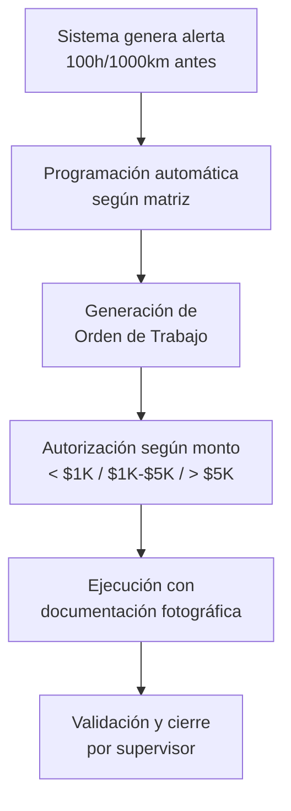
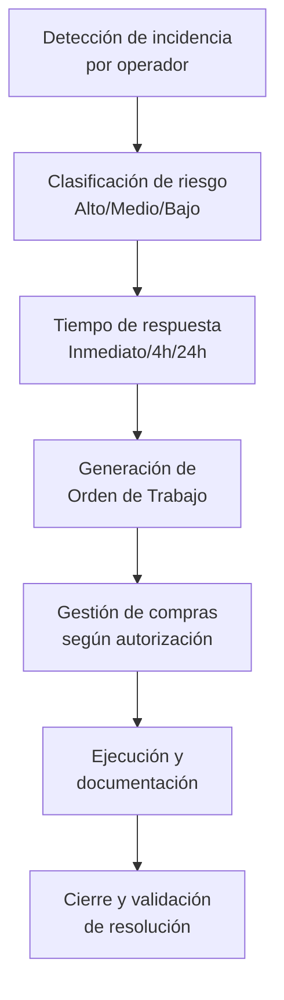
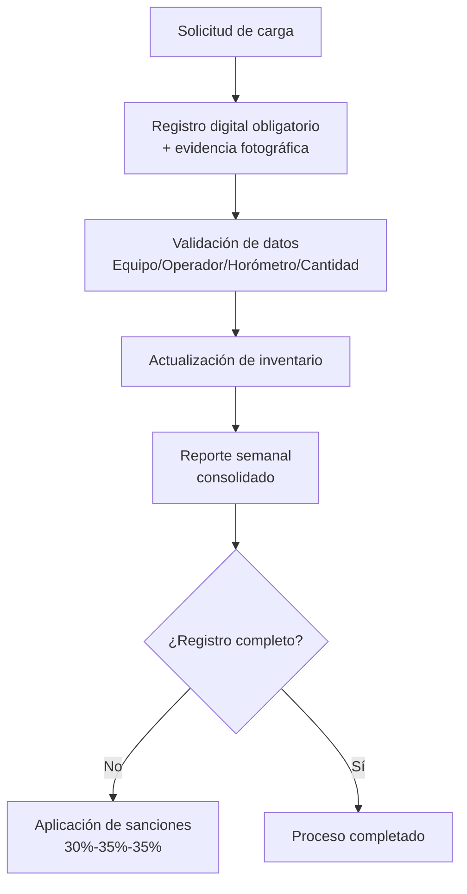
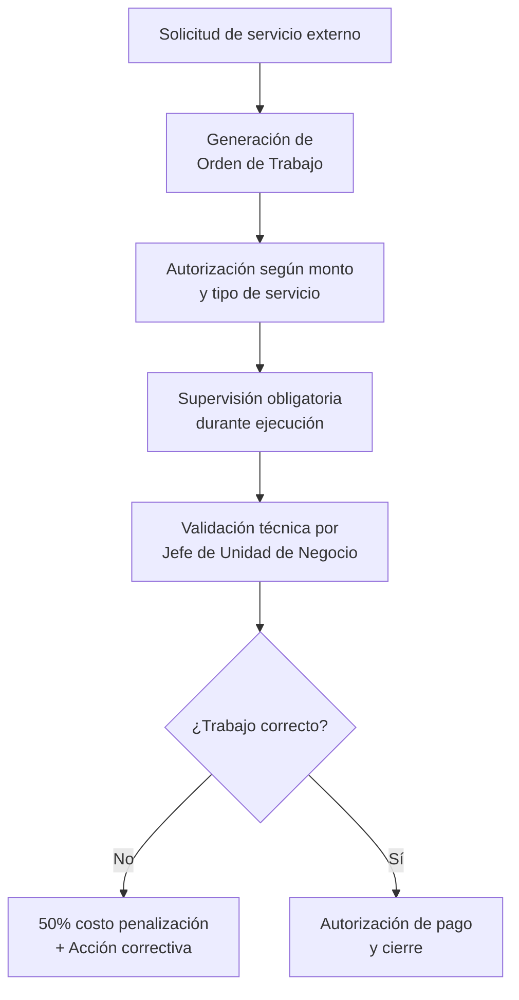
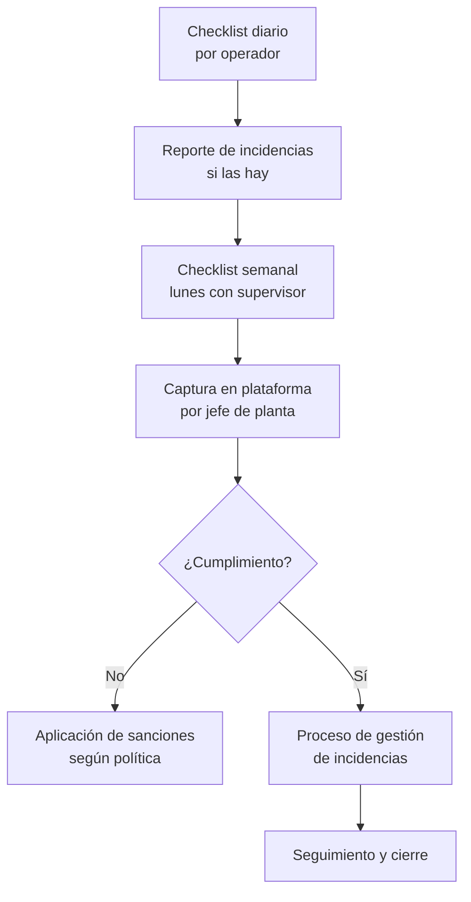

# Resumen de Estructura y Procesos
## Departamento de Mantenimiento - DC Concretos S.A. de C.V.

---

## 1. ESTRUCTURA ORGANIZACIONAL

### 1.1 Organigrama del Departamento

```
                        Gerencia General
                              |
                ┌─────────────────────────────┐
                |                             |
    Jefe de Unidad de Negocio           Jefe de Unidad de Negocio
           (Bajío)                            (Tijuana)
              |                                  |
    ┌─────────────────┐                ┌─────────────────┐
    |                 |                |                 |
Encargado de     Área Administrativa   Auxiliar      Jefes de Planta
Mantenimiento    (función compras)     de Compras    (Plantas 2,3,4)
    |                 |                    |              |
┌───┴───┐        ┌────┴────┐         ┌────┴────┐    ┌────┴────┐
|       |        |         |         |         |    |         |
Planta 5  León/Planta 1   Planta 5   Plantas   Operadores  Dosificadores
Jefe de   Dosificador     Operadores  2,3,4     
Planta    (rol jefe)                  Operadores
|
Operadores
```

### 1.2 Distribución por Unidad de Negocio

#### **Bajío (2 plantas)**
- **Jefe de Unidad de Negocio Bajío**
- **Encargado de Mantenimiento** (gestión técnica especializada)
- **Área Administrativa** (función de compras)
- **León/Planta 1**: Dosificador (función de jefe de planta) + Operadores
- **Planta 5**: Jefe de Planta + Operadores

#### **Tijuana (3 plantas)**
- **Jefe de Unidad de Negocio Tijuana**
- **Auxiliar de Compras** (rol dedicado)
- **Plantas 2, 3, 4**: Cada una con Jefe de Planta + Operadores + Dosificadores

### 1.3 Matriz de Roles y Responsabilidades

| Rol | Responsabilidad Principal | Ubicación | Particularidades |
|-----|---------------------------|-----------|------------------|
| **Jefe de Unidad de Negocio Bajío** | Coordinación Bajío y autorizaciones | Bajío | Supervisa Encargado de Mantenimiento |
| **Jefe de Unidad de Negocio Tijuana** | Coordinación Tijuana y autorizaciones | Tijuana | Supervisa 3 plantas |
| **Encargado de Mantenimiento** | Gestión técnica especializada | Solo Bajío | Rol técnico especializado |
| **Jefe de Planta** | Operaciones locales y supervisión | Planta 5, Plantas 2,3,4 | No existe en León/Planta 1 |
| **Dosificador** | Operaciones y control | Todas las plantas | En León actúa como jefe de planta |
| **Operadores** | Ejecución operativa y reporte | Todas las plantas | Base operativa |
| **Auxiliar de Compras** | Gestión de adquisiciones | Solo Tijuana | En Bajío lo cubre Administración |
| **Área Administrativa** | Gestión de compras | Solo Bajío | Cubre función de auxiliar de compras |

---

## 2. POLÍTICAS PRINCIPALES

### 2.1 Mantenimiento Preventivo
- **Programación automática** a 100 horas/1,000 km antes del vencimiento
- **Matrices específicas** por tipo de equipo
- **Alertas obligatorias** con tiempo de respuesta medible

### 2.2 Control de Combustible
- **Registro digital obligatorio** con evidencia fotográfica
- **Sanciones por incumplimiento**: 30% operador, 35% jefe planta, 35% jefe unidad

### 2.3 Órdenes de Trabajo
- **Obligatorias** para cualquier intervención
- **Niveles de autorización**:
  - < $1,000 MXN: Automática
  - < $5,000 MXN: Jefe de Unidad de Negocio
  - > $5,000 MXN: Gerencia General

### 2.4 Servicios Externos
- **Supervisión obligatoria** durante servicio
- **Validación técnica** por Jefe de Unidad de Negocio
- **Penalización del 50%** por validación incorrecta

---

## 3. PROCESOS PRINCIPALES

### 3.1 Proceso de Mantenimiento Preventivo



### 3.2 Proceso de Mantenimiento Correctivo



### 3.3 Proceso de Control de Combustible



### 3.4 Proceso de Servicios Externos



### 3.5 Proceso de Checklist y Inspecciones



---

## 4. FLUJOS DE AUTORIZACIÓN

### 4.1 Compras y Autorizaciones

| Monto | Autorización | Responsable |
|-------|--------------|-------------|
| < $1,000 MXN | Automática | Sistema |
| $1,000 - $5,000 MXN | Manual | Jefe de Unidad de Negocio |
| > $5,000 MXN | Gerencial | Gerencia General |

### 4.2 Escalamiento de Incidencias

```
Nivel 1: Operador → Jefe de Planta/Dosificador
Nivel 2: Jefe de Planta → Encargado de Mantenimiento (Bajío) / Jefe de Unidad (Tijuana)
Nivel 3: Responsable Técnico → Jefe de Unidad de Negocio
Nivel 4: Jefe de Unidad → Gerencia General
```

---

## 5. PARTICULARIDADES POR UBICACIÓN

### 5.1 Bajío
- **Encargado de Mantenimiento**: Rol técnico especializado disponible
- **León/Planta 1**: Dosificador actúa como jefe de planta
- **Compras**: Gestionadas por área administrativa
- **Cobertura**: 2 plantas

### 5.2 Tijuana
- **Sin Encargado de Mantenimiento**: Jefe de Unidad asume responsabilidades técnicas
- **Auxiliar de Compras**: Rol dedicado para gestión de adquisiciones
- **Estructura uniforme**: Todas las plantas con jefe de planta
- **Cobertura**: 3 plantas

---

## 6. INDICADORES CLAVE DE PROCESO

### 6.1 Operativos
- **Disponibilidad de equipos**: Meta 95%
- **Tiempo de respuesta a incidencias**: Según criticidad
- **Cumplimiento de mantenimiento preventivo**: 100%

### 6.2 Administrativos
- **Cumplimiento de checklist diarios**: 100%
- **Registro completo de combustible**: 100%
- **Tiempo de cierre de órdenes de trabajo**: Medible

### 6.3 Financieros
- **Presupuesto de mantenimiento**: Control por autorización
- **Efectividad de servicios externos**: Sin retrabajos
- **Recuperación de garantías**: Seguimiento activo

---

*Este resumen refleja la estructura actual y los procesos establecidos para el departamento de mantenimiento en todas las ubicaciones de DC Concretos.*